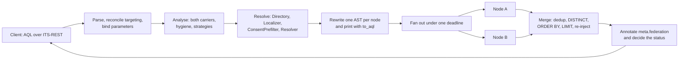
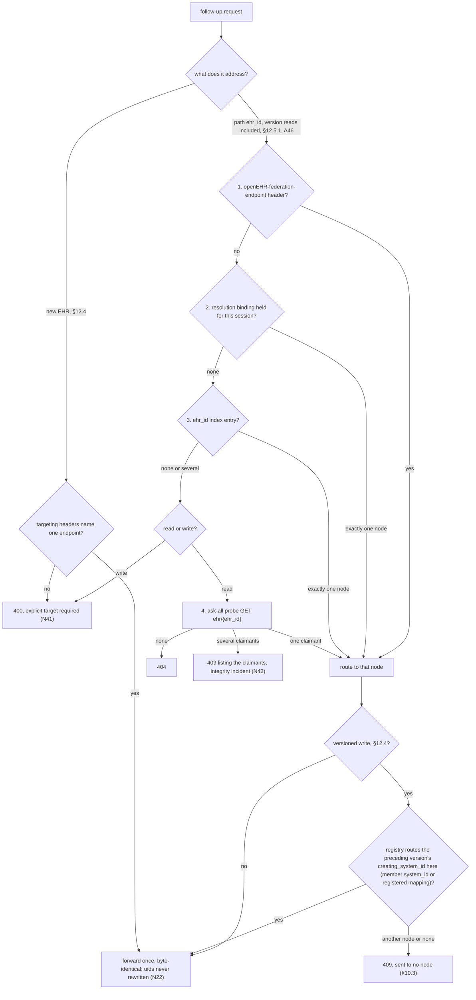
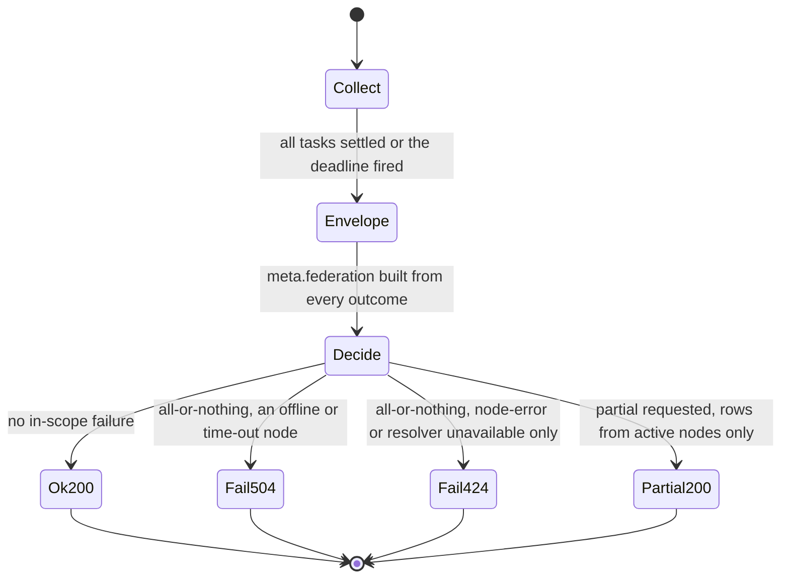
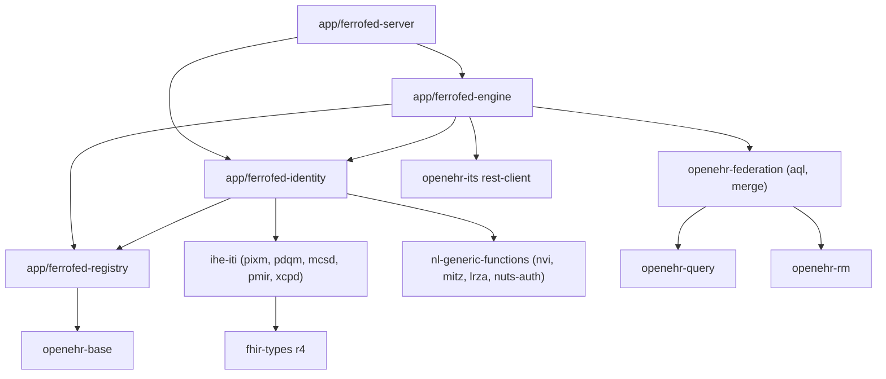

<!-- SPDX-FileCopyrightText: Vernum Projecten B.V. -->
<!-- SPDX-License-Identifier: BUSL-1.1 -->

# Architecture

FerroFED is an openEHR federation gateway: a transparent ITS-REST intermediary
that takes an ordinary AQL query, resolves the patient outside the query,
sends standard AQL scoped to each node's own `ehr_id`, and merges what comes
back with each node's provenance. It follows the openEHR Federation Working
Group's Federation Tier with AQL specification and holds no clinical data of
its own.

This document is the design of record. It is the output of the first research
pass of 2026-10-01 (program #16), whose full reports are the evidence comments
on #18 to #27. Every decision below names its ground: a section, requirement
(N) or conformance point (CP) of the specification, a section of ITS-REST or
AQL, an IHE profile, an RFC, or published research. Where the specification is
silent, the decision is labelled FerroFED's own. Where it contradicts itself or
another specification, the contradiction is named and held as an
upstream-report draft on #17, to be re-checked against the 1.0 release.

Three owner rulings of 2026-10-01 shape every section:

- **The published `openehr-*` crates are the openEHR surface.** FerroFED
  re-implements nothing they provide. A gap in one of them is an issue on
  FerroEHR's tracker, and the FerroFED issue that needs it is blocked by it
  (section 2).
- **The reference implementation is evidence, not the bar.** FerroFED is held
  to FerroEHR's strictness: it accepts exactly what the specification admits
  and asserts every refusal with a negative test. That the Java reference
  implementation accepts a form, merges a result a certain way, or claims a
  conformance point proves nothing. Every place where it is laxer than the
  specification is named below and recorded on #17.
- **Build what FerroFED needs inside FerroFED first.** No capability waits on
  a sibling that is not built yet. FerroPIX, the family's planned MPI over
  PIXm and PDQm, exists only as a repository today, so every identity binding
  the gateway needs lands here, each as a self-contained crate behind its
  trait seam, shaped so it can move to FerroPIX later without changing the
  gateway core (sections 6 and 11).

The decision register in section 15 lists every choice this pass put to the
owner. The owner decided all of them on 2026-10-01, and the text describes the
decided design.

## 1. The problem and the specification pin

A record held by another organisation is out of reach of a client that speaks
to one CDR. The Federation Tier with AQL lets a client run one AQL query across
several CDRs as if they were one repository (§1). The Tier is a transparent
intermediary: a client sends a conformant AQL query and follow-up requests
without knowing it is federated, across the whole ITS-REST surface, read and
write (§1, N1). Federation keys on each node's local `ehr_id`. The patient is
resolved to a set of `{node, ehr_id}` pairs outside AQL, through an identity
cross-reference service (§5), and each node then receives standard,
non-federated AQL scoped to its `ehr_id` (§4, §7). The patient identifier used
for resolution is consumed at the gateway and never reaches a node, in any
carrier (§5.4, N33).

The specification is a release candidate circulated for comment. Its 1.0
release is expected the week of 2026-10-08, and #17 re-pins to it: re-vendor,
diff, re-cite every issue, and re-check the held upstream-report drafts.

**Pinned versions.** The pins live in `docs/VERSIONS.md`; this table records
the ground for each, and `scripts/checks/versions.sh` holds the two in step.

| Component | Pin | Ground |
|---|---|---|
| Federation Tier with AQL | 0.9.0 (`syntaric/openehr-federation-spec` at `7162d0c760d23105d62a743bf0ad1073c45fdb85`, 2026-09-28, CC0 1.0) | the specification FerroFED implements. The pinned commit is past the `0.9.0` tag and carries the SEC review amendments (the `meta.federation` nesting, the all-or-nothing default, the `node-error` status) while `antora.yml` still declares `0.9.0`, which is held as a draft on #17 |
| Federation Tier reference implementation | `syntaric/openehr-federation-ref` at `92aff3cb1d8738ea0ce0e013b5a8fc2942438fd5` (Apache-2.0) | evidence and a test corpus (the 17 AQL golden cases, the schemas, the demo data); never the bar, its code never copied. Its copy of `federated-result-set.schema.json` lacks `node-error` |
| openEHR ITS-REST | 1.1.0 (`openEHR/specifications-ITS-REST` tag `Release-1.1.0`, commit `24058992`) | the federation specification binds ITS-REST by name at `Release-1.1.0`; the façade serves all 96 operations of its seven modules |
| openEHR AQL | 1.1.0 (`openEHR/specifications-QUERY` tag `Release-1.1.0`, commit `b03c4800`) | the query language. AQL 1.1.0 leaves the default order, the order of nulls and string collation undefined and has no `GROUP BY` clause, which sections 4 and 9 build on |
| `openehr-query` | 0.0.81 | the AQL 1.1 lexer, parser, typed AST and canonical printer. 0.0.74 added the visitor, spans, parameter binding and the federation directive (FerroEHR #3505 to #3508, #3513); 0.0.77 classifies every function call as an AQL built-in or another name (FerroEHR #3529) |
| `openehr-its` | 0.0.81 | the ITS-REST 1.1.0 contract: DTOs, server traits, route tables, clients, canonical JSON. 0.0.74 added the router builder, the operation matcher with `forward`, the credentials provider and per-call options (FerroEHR #3509 to #3512); 0.0.76 keeps the extra members of an open schema, `Error` among them (FerroEHR #3526); 0.0.77 builds every client with redirects off (FerroEHR #3531); 0.0.78 makes the `Authorization` value of a credential public, checked against RFC 7617 and RFC 6750 (FerroEHR #3535); 0.0.80 adds the identifier class of each path parameter, a public request decoder per operation, a Simplified Formats CONTRIBUTION reader and every request-body media type (FerroEHR #3539 to #3541, #3543) |
| `openehr-base`, `openehr-rm` | the same lockstep line | typed identifiers (`ObjectVersionId`, `HierObjectId`, ISO 8601 ordering), the RM with `DV_ORDERED` comparison and, from 0.0.79, the attribute model with the BASE primitives, the `Ordered` marker and the `OBJECT_REF` targets (FerroEHR #3537) |
| `openehr-sdt` | 0.0.81, the same lockstep line, joined with client authentication (#80) | the SMART on openEHR scope grammar |
| IHE PIXm, mCSD, PMIR | 3.1.0, 4.0.0, 1.6.0 (FHIR 4.0.1, CC-BY-4.0) | the proposed IHE binding (Annex A). Each is vendored and pinned with the issue that first reads it (decision A18) |
| Netherlands Generic Functions | `fhir.nl.gf` 0.3.0 (EUPL-1.2) | the regional binding Annex B names; vendored with #87 |
| `fhir-types` | 0.1.107 (`r4` with `terminology`, `resources` from the PDQm client #119 and the mCSD reader #74; Apache-2.0) | the FHIR R4 model for PIXm `Parameters`, the PDQm `Patient` and the mCSD resources, compiled only in the IHE adapter crate (decision A16) |
| `jsonwebtoken` | 11, on `aws_lc_rs` | the family's JWT crate, for inbound validation and outbound assertions |
| `jsonschema` | 0.58.3 (draft 2020-12, `if`/`then`) | test-side validation of every envelope and `OPTIONS` body against the vendored schemas |
| PostgreSQL | 18 | only behind the optional high-availability backend of the stored-query store (section 8); a single gateway needs no database |

The `openehr-*` rows are the lockstep 0.0.81, published on 2026-10-03. The
gaps FerroEHR #3505 to #3514 closed in 0.0.74, which v0.0.2 coded against,
0.0.76 closes FerroEHR #3526, the open ITS-REST `Error`, 0.0.77 closes
FerroEHR #3529, the function classification the rewrite reads, 0.0.78
closes FerroEHR #3535, the `Authorization` value configuration load checks,
0.0.79 closes FerroEHR #3537, the model lookups the rewrite orders keys by,
and 0.0.80 closes FerroEHR #3539 to #3541 and #3543, the request decoder, the
path identifier classes, the Simplified Formats CONTRIBUTION and the body
media types, and 0.0.81 closes FerroEHR #3548, #3551 and #3552, the typed
`201_EHR` body, the public body media-type picker and the agreeing media
tables.

## 2. The openEHR surface: the published crates

FerroFED takes every openEHR concern from the published crates, as one family
on one lockstep version. The table fixes what each crate carries for the
gateway.

| Crate (feature) | What FerroFED takes from it |
|---|---|
| `openehr-query` (`federation`) | AQL 1.1.0: `parse_str`, the typed AST, `printer::to_aql` with the fixed point `parse(to_aql(ast)) == ast`, `visit::Visit` and `visit::VisitMut`, `ast::Span` on every `IdentifiedPath` and `WHERE` leaf, `bind::bind` for `query_parameters`, and `federation::parse_federated` / `to_federated_aql` for the `FROM ENDPOINT` directive |
| `openehr-its` (`rest-server`) | the generated `server::router` per group, used where the typed contract fits (section 5) |
| `openehr-its` (`rest-client`) | one `rest::client::Client` per endpoint, `routes::lookup` (the operation matcher), `Client::forward` (one unclassified send with the bytes as received), `CredentialsProvider` and `CallOptions { deadline, headers }` |
| `openehr-its` (`rest`, `json`) | the `AdhocQueryExecute`, `ResultSet`, `ResultSetMetadata` and `ResultSetColumn` DTOs, with `ResultSetMetadata.additional_properties` as the extension point `meta.federation` occupies (N17), and canonical JSON of the RM |
| `openehr-base` | `ObjectVersionId` (`object_id()`, `creating_system_id()`, `version_tree_id()`), `HierObjectId` for `ehr_id`, the lexical rule for `system_id`, and `PartialOrd` on the ISO 8601 types |
| `openehr-rm` | `DV_ORDERED`'s `less_than` and `is_strictly_comparable_to`, for cross-node ordering of data values |
| `openehr-sdt` (`smart_scopes`) | `SmartScope::parse` and `parse_all` for the SMART on openEHR scope grammar (section 7), read by client authentication (#80) |

The research found eight gaps between these crates and what an intermediary
needs, filed as FerroEHR #3505 to #3512, and the work found a ninth (#3513, a
parser defect for `[$p and at0001]` and `[<archetype id> or …]`). All nine are
built on FerroEHR's side and ship in the lockstep 0.0.74, which is FerroFED's
pin for the workspace (section 1). Two residuals are FerroEHR's to note:
`Client::forward` defaults `Accept` when the client sent none, which a
byte-transparent intermediary would rather opt out of (one sentence on #3510),
and the ITS-REST OpenAPI documents leak `operationId: definition_query_store.yaml`
into generated method names.

**Typed carriers.** FerroEHR bans `serde_json::Value` outside approved seams
(clippy `disallowed-types`). FerroFED adopts the rule unchanged from #28
(decision A2). The ITS-REST contract itself puts `Value` in three places the
gateway touches, so the seams are fixed by the wire. Each is one module with a
scoped `#[expect]` naming it:

1. **Query intake.** `query_parameters` become `ast::Primitive` once, at the
   façade boundary, before `bind`. A JSON string becomes `String`, an integral
   number `Integer`, any other number `Real`, a boolean `Boolean`. A `null`, an
   array or an object is a `400` naming the parameter, never its value. The GET
   forms carry strings only, typed by the position they bind to.
2. **Result cells.** `ResultSetRow` from each node is decoded once by a cell
   codec: an RM object through canonical JSON into its RM type, a primitive as
   itself. The merged row is re-encoded on the way out, and no other module
   sees a `Value` cell.
3. **The envelope.** A typed `FederationMeta` is serialized once into
   `ResultSetMetadata.additional_properties["federation"]`, and the `424`/`504`
   failure envelope is built from the same type.
4. **Tests.** Schema validation hands `jsonschema` a `Value`, under
   `#[cfg(test)]` and in the testkit.

Single-node passthrough bodies, node error bodies, the `OPTIONS` bodies and the
registry are never seams.

## 3. The request pipeline

A federated query goes through five stages. The first resolves where the
patient is and under which local id; the rest are pure transformations over
typed values, except the fan-out.



1. **Resolve** (§4 Step 1, §5, §14, §15). The analysis yields a `PatientRef`
   (identifier plus issuing namespace). The registry snapshot, the localizer,
   the optional consent pre-filter and the cross-reference resolver turn it
   into the set of `{node, ehr_id}` pairs to dispatch to, and a status for
   every member that is not dispatched (section 6).
2. **Rewrite** (§7.1). One node AST per resolved node, scoped to that node's
   `ehr_id`, with every directly identifying identifier consumed or the query
   refused (section 4).
3. **Fan out** (§11.5, N38). One request per in-scope endpoint, concurrent,
   under a deadline fixed at entry (section 9).
4. **Merge** (§9 to §11.6). Positional decoding against the gateway's own
   `SELECT`, opt-in dedup, `DISTINCT`, the cross-node order, `LIMIT` and
   `OFFSET`, and the re-injected columns (section 9).
5. **Annotate** (§9.5, §11.4, N16, N17). `meta.federation` lists every registry
   member with its status, and the completeness decision picks `200`, `424` or
   `504`, carrying the envelope in every case (section 9).

A follow-up read or write to one record takes the single-node path of section
5 instead: no rewrite, no merge, byte-identical passthrough to the node that
holds it.

## 4. The AQL rewrite and identifier hygiene

Research: #18. Every step is a call on `openehr-query` or a pure function over
its public AST. FerroFED has no AQL parser, no printer and no text splicing.

**The pipeline.**

1. **Parse** with `federation::parse_federated`. It lifts a `FROM ENDPOINT` /
   `ORGANISATION` directive out at the token level, so the same words inside a
   string literal stay a string, and parses the remainder as strict AQL 1.1.0
   with spans kept (§8.1). The directive grammar is an extension no openEHR
   release defines, and it lives behind the crate's opt-in feature (decision
   A1).
2. **Reconcile targeting.** The directive and the
   `openEHR-federation-endpoint` / `openEHR-federation-organisation` headers
   must name the same set, or the request is `400`. An unknown identifier is
   `400` (§8.4.1, N35).
3. **Bind** the request's `query_parameters` with `bind::bind` before any
   analysis, so `… = $patient` is analysed as the literal it stands for. AQL
   substitutes a parameter "following the same rules as each type when the
   value is specified as a literal" (`master03-syntax.adoc` §Parameters), and
   §5.4.1 tests a value wherever it sits, so the order is forced. Faults name
   the parameter and its position, never the value.
4. **Analyse** on `visit::Visit`. The visitor is exhaustive, with no wildcard
   arm, so a new AST variant fails to compile in the traversal. A hand-written
   walk missed four literal positions in the research's experiment (a
   `MATCHES` list, a containment predicate, a function argument, a `SELECT`
   constant):
   - locate the patient in either carrier: `external_ref/id/value` with its
     `namespace`, or an `ENTRY`-level `subject/identifiers` with its
     `issuer`/`type` (§5.4.3, N33, CP-38);
   - take the namespace from the query, else from a declared default issuing
     namespace, else refuse `400` (§5.2; decision A5);
   - refuse a non-String operand on an identifier path, written or bound
     (decision A6);
   - enforce the reduction constraint: one patient value, in the top-level
     `AND` chain, under `=` (§7.1). The same value repeated is consumed once;
     two different values are `400` (decision A7);
   - refuse a directive-variable path outside the §9.3 attribute set (decision
     A9), and a query whose node set the specification does not define
     (decision A8);
   - fold `CONCAT`, `CONCAT_WS` and `SUBSTRING` over literal arguments, and
     refuse a string function over a literal that cannot be folded on an
     identifier-bearing path (decision A4);
   - run the value test over every client literal the visitor reaches: equal
     to the patient value, or containing it, on any path, is a `400` (§5.4.1).
     A clinician predicate with a different value is legitimate (§5.4.3 note,
     golden case 08);
   - refuse what the declared strategies refuse: `OFFSET` or the ITS-REST
     `offset` member past the window, and undirected aggregates (N14, N39).

   A refusal is `400` carrying the span of the offending path or leaf and never
   the value (§5.4.3 last bullet).
5. **Rewrite per node** with `visit::VisitMut`, one AST per node with a
   resolved `ehr_id`: replace the patient predicate with
   `<ehr>/ehr_id/value = '<ehr_id>'`, the canonical form of N29; remove the
   consumed namespace leaves, the subject projections and the directive's
   projections; wrap `FROM` in `EHR e CONTAINS …` when the query had no `EHR`
   containment (decision A3); add the hidden `ORDER BY` columns and the uid
   tie-break of section 9. The resolved `ehr_id` is validated as an RM
   `HIER_OBJECT_ID` through `openehr-base`, never by a UUID pattern, because
   N42a admits "UUID-v4 or equivalent".
6. **Print** each node AST with `printer::to_aql`. A value reaches the text
   only through the printer's escaping, and comments never survive a parse
   (golden case 12). FerroFED builds one AST per node; it never renders a
   template once and substitutes a string into it, as the reference
   implementation does.
7. **Gate** the composed request line and headers: no path segment, query
   parameter or header value equals a consumed identifier (N33). The URL
   authority, and the `Host` header the HTTP client writes from it, are the
   registry's and are not read (decision A48). The node-side wire capture of
   track 10 (#90) is the backstop.

`columns[]` is rendered once, from the façade AST, with
`IdentifiedPath::column_path_text` and the select alias (or `#i`), never from a
node's answer (§9.2, N17, CP-35). Rows are positional, so the merge maps each
node column to its façade index and inserts the re-injected subject constant
(N5) and any selected ENDPOINT attribute (N12, N18) at theirs.

**ITS-REST paging members.** `AdhocQueryExecute` and the stored-query bodies
carry `offset` and `fetch` beside the AQL, and the GET forms carry them as
parameters. §11.6 and N39 speak only of AQL `OFFSET` and `LIMIT`. FerroFED
treats `offset` exactly as AQL `OFFSET` under the declared strategy and `fetch`
as `LIMIT`, and refuses a request that sets the clause and the member to
different values (decision A10; draft on #17).

**A query with no patient carrier.** N4 derives an undirected node set from
localization, and localization is keyed on the patient. FerroFED answers such a
query only where its node set is defined: directed by the directive or the
header (§8), or ask-all in a deployment with no localizer (N4's last sentence).
Where a localizer is configured and nothing names the nodes, it is `400`
(decision A8).

**Only the subject selected.** The specification is silent. FerroFED dispatches
`SELECT e/ehr_id/value` per node, so each row stands for an EHR that exists,
and answers each row with the re-injected input (N5). FerroFED's own.

**The golden cases.** The reference implementation's 17 cases run as a corpus
test compared by AST equality, because parenthesisation and spacing are the
printer's. On published 0.0.72, 16 of the 17 already pass as a rewrite written
against the public AST alone; the 17th is the directive, which 0.0.74's
feature parses. Each case is adjudicated against the specification text: none
is disagreed with, and four are adopted on a different mechanism or scope (02
the crate feature and the strict attribute set; 05 a declared strategy that
also covers the ITS-REST member; 11 the node-set rule; 13 the `EHR` wrapping).
Beside them sits FerroFED's own strict corpus, each case an asserted test:

- an unqualified identifier with no declared default namespace (`400`);
- an integer literal on the String-typed identifier path (`400`);
- the subject under `!=`, `<`, `>`, `MATCHES`, `EXISTS` and `NOT` (`400`);
- the same subject value twice (consumed once);
- the subject path in `ORDER BY` (§5.4.2 names it a leak path);
- a parameter bound to the patient value in a non-subject position;
- `CONCAT('12','345')` rebuilding the identifier at the node;
- directive and header with different sets (`400`) and identical sets;
- two `ENTRY` qualifiers that do not reduce to one namespace (`400`);
- a namespace predicate with no id predicate (ordinary query material);
- `COMPOSITION c[$t and …]` binding and analysing (#3513);
- a query with no `EHR` containment (wrapped, not refused).

**Where the reference implementation is laxer than the specification.** Each is
recorded on #17 and refused here:

- an unqualified identifier resolves in a default namespace that falls back to
  the literal `"facade"` when unconfigured (§5.2 requires the namespace);
- an integer operand is coerced to the identifier's digits, although
  `OBJECT_ID.value` and `DV_IDENTIFIER.id` are `String`;
- `p/organization` is accepted through the directive, which neither §8.3 nor
  §9.3 names;
- the ITS-REST `offset` and `fetch` members are dropped without a word, and
  `GET /v1/query/aql` answers `501`;
- `GET /v1/ehr?subject_id=` forwards the patient identifier to a node;
- its final hygiene gate is a substring search over all composed text, which
  misses `CONCAT('12','345')` and false-positives on short values.

It is also stricter than the specification in two places, which refuse
queries the specification admits: a query with no `EHR` containment, and a
`SELECT` of only the subject. FerroFED answers both.

**Two specification gaps held on #17.** Stripping an `ENTRY`-subject predicate,
as §5.4.3 requires, widens "compositions with an OBSERVATION about this
subject" to "any composition with an OBSERVATION in this EHR", which also
matches entries whose subject is a `PARTY_RELATED` (family history). And a
second value in an `ENTRY` carrier may name a relative, which the gateway
cannot tell from the patient by path; FerroFED refuses it, the reading that
cannot leak.

## 5. The façade and node dispatch

Research: #26. The façade serves the 96 operations of the generated route
tables, split by what each area needs (decision A11):

| Area | Operations | How |
|---|---|---|
| `query` | 6 (ad hoc and stored, GET and POST) | FerroFED handlers over the generated DTOs, matched by `routes::lookup`; fan-out under sections 3 and 9. They answer `424`/`504` with `meta.federation` (N37), which `ApiError` and the typed answers cannot express, and which belong in no ITS-REST crate |
| `ehr` | 33 | single-node and byte-identical: `routes::lookup` names the operation from the method and path without reading the body, the routing of §12 picks the node, and `Client::forward` sends it once, unclassified and unretried |
| `definition/template` | 9 | single-node to an explicitly chosen node, as `ehr` (§12.6, N43); where `federation.fan_out_template_upload` is set, a template upload naming `*` or several endpoints fans out to each, `Client::forward` per member, answered per node with `meta.federation` and never rolled back (§12.6 `template-fanout`, #76) |
| `definition/query` | 4 | the generated router over the gateway-held registry when N44 is on; single-node raw otherwise; where `federation.fan_out_stored_queries` is set beside the registry, a `PUT` naming `*` or members is also distributed to each and a `GET` naming them reports drift per member (§12.7, #78) |
| `admin` | 2 | single-node raw, explicit target only |
| `demographic` | 41 | the generated router with every method at its `501` default (§7a.1, N32) |
| `system` | `OPTIONS {base}/v1/` | ITS-REST's own body through the typed System trait (N1) |
| federation | `OPTIONS {base}/` | FerroFED's handler: the §7a.2 body, validated against `options-root.schema.json` (N30). The two `OPTIONS` documents live at different URLs, so a client of a single CDR still gets the shape it expects |

The typed traits decode request bodies into RM types, which N22, N31 and §7a.3
rule out for a single-node route, so those routes go through the matcher and
`forward` instead.

**Single-node answers.** Status, body, `Location` and `ETag` pass through
unmodified (N22, N31). The routed handler adds `openEHR-federation-endpoint`
and `openEHR-federation-system-id` to every routed answer, the gateway's own
`504` and `424` for a node that gave no answer included, and hop-by-hop fields
are stripped from the answer (RFC 9110 §7.6.1). The request side is an
allow-list read from `openehr-its`'s per-operation parameter table
(`routes::lookup`, FerroEHR #3530): the request headers the matched operation
declares and nothing else, so neither a hop-by-hop field, the client's
`Authorization` or `X-Request-Id` nor any other client header reaches a node,
and a query string travels only when the operation declares every parameter
in it; any other is a `400` before dispatch (§5.4.1, N33). `subject_id` and
`subject_namespace` are refused wherever declared. The `openehr-its`
transport follows no redirect (FerroEHR #3531), so a node's `3xx` is passed
on as the node's answer and no request is re-sent to a host the registry does
not name. Built in #61 for the EHR area, with the full §12.5.1 order of a
path `ehr_id` in #62. A CDR's `Location` is usually an
absolute URL on the node, so a client that follows it bypasses the gateway,
which works against N1 and N28. FerroFED passes it unmodified as N31 requires,
and the conflict is a draft on #17 to revisit at the re-pin (decision A13).

**Follow-up routing.** A follow-up names its node in one of four ways, and
each has its own normative order (§12.3 to §12.5, the routing-key table of
§12a.2). A path `ehr_id` is resolved by the explicit target, the session's
resolution binding, the `ehr_id` index, and only for a read an ask-all probe,
never skipping a step that answers (N41); several claimants are a `409` and an
integrity incident, never a choice (N42). A read of a `VERSION` under a path
`ehr_id` routes by that `ehr_id` in the same order, never by its
`creating_system_id` (decision A46): every ITS-REST version read is
EHR-scoped, so the order of §12.3 routes none of them. A versioned write is
EHR-scoped too: it routes by its path `ehr_id` in the same order, never by
ask-all, and is sent only when the registry routes the preceding version's
`creating_system_id` to that same node, as the member's own `system_id` or a
registered mapping, never a learned one (§12a.1 `route-write`, N23). When the
two name different nodes, or the registry names none, the write is a `409`
and no node is sent it, because the path `ehr_id` cannot be rewritten for the
controlling node (N22) and a commit at a holder would fork the object (§10.3
`copy-write-reject`). A write naming no single preceding version is a `400`.
A new EHR goes only to the endpoint the targeting headers name, and a write
no step routes is a `400` (N23, N41). The answer is forwarded once,
byte-identical, and no uid is rewritten.



**`GET {base}/v1/ehr?subject_id=`.** `ehr_get_by_subject` carries a patient
identifier in the query string, which N33 forbids the gateway to dispatch, and
the specification is silent on the operation. FerroFED treats `subject_id` and
`subject_namespace` as resolution input (§5.2), dispatches
`GET {base}/v1/ehr/{ehr_id}` to the one node that resolved, answers `404` when
none did, and `409` naming the claimants when several did, the N42 shape
(decision A12; FerroFED's own; draft on #17). Built in #218: the targeting
header narrows the resolution to the one endpoint it names (§8.4), which is
how a client reads one of several holders, and a cross-reference that cannot
answer for a member is a `424`, never the `404`, because that member may hold
the EHR. The `404` is the operation's own: it reads one EHR resource, so
§11.3's `200` with no rows, which answers a query, does not apply.

**A query scoped to one `ehr_id`.** N29 makes `WHERE e/ehr_id/value = …`,
`FROM EHR e[ehr_id/value=…]` and the path `{base}/v1/ehr/{ehr_id}`
semantically equivalent, and §12.5.1 orders only the routing of a path
`ehr_id`; the specification is silent on where an undirected query in either
AQL form goes. FerroFED moves the `FROM` predicate into `WHERE` on the AST
before the scan, so both forms dispatch the canonical query of §7.1, and
routes an undirected query scoped to exactly one `ehr_id` as a read of that
path: binding, index, then the ask-all probe, every other member reported
`excluded` and the acting endpoint named (N31). A directive or a targeting
header is step 1 and is never overridden (#69; FerroFED's own).

**The base path.** The gateway serves every route under `[server] base_path`,
`/` by default; it reserves no prefix and checks the path at boot (§4.1, N28,
#69). A node is always asked at its own base URL, so the gateway's base never
travels.

**Per-node clients.** Each endpoint has one `rest::client::Client` built from
the registry snapshot: its base URL, a `CredentialsProvider` for the onward
grant (section 7) and a retry policy. Every call carries `CallOptions` with the
deadline derived from the §11.5 budget and the conveyed client identity (N24).
The deadline bounds the whole call: no attempt or backoff runs past it, and
each attempt's engine timeout is the time left. The overall budget is the
fan-out's own timeout over the join (section 9).

## 6. Identity, localization and addressing

Research: #19. FerroFED keeps the three Step-1 questions apart, as §14 and
§5.2 do: localization says where a patient's data might be, the optional
consent pre-filter says which nodes may not be asked, and resolution says under
which local `ehr_id` each remaining node knows the patient. A localization hit
is candidacy, never clearance (N27, §14.3), and a Tier "MUST work in either [a
consent-aware or a plain locator] without change" (§14.3).

**The seams** (decision A14). One trait per role, exactly one active
implementation per role, chosen in configuration. One adapter type may
implement several traits (a regional service that answers both where and
whether); the core never assumes it does.

| Trait | Returns | Role |
|---|---|---|
| `Directory` | `Arc<RegistrySnapshot>` | the addressing registry (N21, §15), refreshed off the clinical path; a query never awaits a directory call |
| `Localizer` | `NotConfigured`, `Candidates(set)`, `NoRecords`, `Unavailable(error)` | where (N4, §14) |
| `ConsentPrefilter` (optional) | `Denied(set)`, `NoSignal`, `Unavailable(error)` | which candidates may not be asked (N27a); absence from `Denied` asserts nothing |
| `Resolver` | per member: `Resolved(EhrId)`, `Unknown`, `Unavailable(error)` | under which local id (N3, §5.2) |
| `OnwardAuth` | per endpoint: a `CredentialsProvider`, the conveyance header, an optional transport layer | how the gateway authenticates to each node (section 7) |

No seam returns an error to the core. A backend that did not answer is an
`Unavailable` outcome carrying its reason. Each seam runs inside its own
budget, declared in `OPTIONS` beside the N38 timeouts, and every seam budget is
a strict part of the overall budget. A configuration whose seam budgets sum
above the overall budget is refused at startup. The order is `Directory`, then
`Localizer`, then `ConsentPrefilter`, then `Resolver`; only `Resolved` members
are dispatched (N8).

**When a seam fails.**

- **The localizer.** A configured localizer that does not answer leaves an
  empty candidate set, every member `not-localized` with the error, and no
  ask-all unless the deployment declared `on_failure: "ask-all"` (N4, §14.1,
  CP-5). XCPD discovery is a broadcast that tells every responding community
  the patient was asked about, which is why §14.1 forbids widening silently.
  With no localizer configured, every registry member is a candidate (§4.3,
  #46). The read of an EHR by subject (`GET {base}/v1/ehr?subject_id=…`) is
  localized too (#409): it names the patient and no node, so it is undirected,
  and N4 and §5.2 speak of "an undirected query" without limiting it to AQL.
  A deployment relies on its localizer to narrow which members learn of a
  patient, so every patient route keeps that narrowing. A targeted read is
  not localized (§8); a localizer that fails closed answers `424
  localization-unavailable` with no member asked. The specification is
  silent on whether a by-subject read is a query; the question is a draft on
  #212. The localizer shows on `GET /health/dependencies` under the members'
  rule and is counted by outcome (#410).
- **The XCPD audit.** ITI TF-2 §3.55.5.1 has the Initiating Gateway record
  an audit message for every exchange, and ITI TF-1 Table 27.1.3-1 groups it
  with an ATNA Secure Node. `ihe-iti` hands the full message to an
  `AuditRecorder`, and a message the recorder cannot accept fails the
  discovery as `LocalizerError::AuditFailed`, which fails closed under every
  `on_failure` policy: ask-all covers a localizer outage, never an exchange
  the gateway could not audit, so no answer is used without its audit. The server's `[xcpd] audit` has no default:
  `log` writes a structured event at the `ferrofed::audit` target without the
  query parameters, and `off` is refused outside the development profile and
  declared in `OPTIONS` (#410).
- **The resolver** (decision A17). A resolver that cannot answer is not a
  patient who is unknown. An ITI-83 `404`, or a `200` with no identifier in a
  domain, is `not-resolved` and, per N6, does not fail the query. An outage, a
  timeout, an ITI-83 `403` (target domain unknown, a configuration fault) or a
  malformed answer is reported `not-resolved` with the error
  `cross-reference unavailable: …`, clears `complete`, and under the
  all-or-nothing default fails the query `424`, as an unreachable in-scope node
  would. §11.1 has no status that separates the two cases, so this is
  FerroFED's own, and the gap is a draft on #17. The reference implementation
  folds every PIX failure into `not-resolved`, so a PIX outage there looks like
  an empty record.
- **The consent pre-filter** (#83). One that does not answer leaves Step 1
  with no consent signal, which is the state of a deployment with no consent
  service, and that deployment is fully conformant (N27a, §13.2.1). Every
  candidate is therefore asked, and each node checks consent itself (N26,
  N27). `OPTIONS {base}/` declares this as `federation.consent.on_unavailable
  = "pass-to-node"` beside the pre-filter's mode. No fail-closed variant is
  offered: no §11.1 status says "not asked because consent could not be
  checked", and `excluded` would leave `complete` true on an answer that asked
  nobody. No specification governs the policy: our own design. The outage is
  carried in `meta.federation.consent.error` beside §14.1's
  `localization.error`, on `/health/dependencies` as `consent` (a decision or
  an answer below `500` is up, a `5xx` failing, no answer down, the members'
  rule) and in `ferrofed.consent.prefilter.requests` by outcome (#400).

**Consent stays with the node** (#83). The pre-filter runs at Step 1 on every
patient route: every federated query, a directed one included, and the read
of an EHR by subject (#399), which answers `403 consent-denied` when every
member that might hold the subject is denied. It runs after localization and
before resolution, over the candidates localization left (every member the
request lets the plan ask, where nothing localizes); a member localization
did not name stays `not-localized`, since nothing decided about it. A member
it denies is `consent-denied` with no `latency_ms`, is never
resolved and never sent a request, and the session's bindings that name it are
dropped (`ResolutionBindings::forget_denied`). A member it does not deny is
asked: absence from `Denied` asserts nothing (§14.3). A node's own refusal is
recognised by an explicit signal only, because ITS-REST 1.1.0 defines none: a
`403` whose ITS-REST `Error` carries a `code` member listed in the endpoint's
`consent_refusal_codes` (native form) or its
`https://ferrofed.eu/fhir/StructureDefinition/consent-refusal-code` extensions
(FHIR form) is `consent-denied`, read through `openehr-its`'s open `Error`;
every other refusal, and every `403` of an endpoint that lists no code, is
`node-error`. The list is empty by default. A node's `consent-denied` carries
the `latency_ms` of the request it refused, because N40 requires it for every
endpoint the gateway dispatched to and names only the pre-filtered form as
settled before dispatch. Either form clears `complete` and fails the query
under neither strategy (§11.1, §11.3, §11.4, N37). The key and the extension
are FerroFED's own design; the missing signal is report T151 on #212.

**The bindings.**

| Role | Binding | Issue | Version |
|---|---|---|---|
| Resolver | the static development cross-reference | #36 | none: FerroFED's own, not a binding of N3 |
| Resolver | PIXm ITI-83 `$ihe-pix` against any conformant PIX Manager (a FerroPIX instance once it exists), one call per PIX Manager with `targetSystem` repeated per member domain (`targetSystem` is `0..*` in the OperationDefinition) | #42, #43 | PIXm 3.1.0 |
| Harness | a PIX Manager answering ITI-83 and seeded by ITI-104 | #47 | PIXm 3.1.0 |
| Lifecycle | the PMIR hook: a merge or split (an ITI-93 notification to an ITI-94 subscription) drops every resolution binding it could have made stale, and the TTL bounds the rest; track 8 is provisional and not claimed | #48 (the hook); the subscription is unscheduled | PMIR 1.6.0, vendored with the subscription that first reads it |
| Localizer | none (ask-all); a registry-scoped PIXm localizer, the members whose domain returned an identifier (§14.2's "demographic-registration" kind) | #46, #85 | PIXm 3.1.0 |
| Localizer | XCPD ITI-55 initiating gateway: HL7 v3 over SOAP 1.2 and, in every US network, a SAML XUA assertion, in its own crate | #85 (decision A15) | ITI TF Vol 2 Rev 20.1 |
| Directory | the static registry document, or an mCSD directory: ITI-90 reads at boot, then ITI-91 `_history`/`_since` synchronised into the snapshot (section 8) | #36, #74, #86 | mCSD 4.0.0 |
| ConsentPrefilter | none; the static development pre-filter (`[[dev.consent_denied]]`, development profile only); then the Annex B Mitz adapter | #83, #87 | none for the development table; `fhir.nl.gf` 0.3.0 for Mitz |

**Built here, movable later.** The protocols live in two published crates
that know nothing of FerroFED: `ihe-iti`, with a feature per profile (`pixm`,
`pdqm`, `mcsd`, `pmir`, `xcpd`), and `nl-generic-functions`, with a feature per
Annex B function (`nvi`, `mitz`, `lrza`, `nuts-auth`). The adapters that turn
those clients into the seams, and the development cross-reference, which binds
nothing, sit beside the traits in `app/ferrofed-identity` (section 11, #106).
The gateway core depends only on the traits. When FerroPIX exists, it can use
`ihe-iti` directly, a binding can move there, or the gateway can point its
PIXm resolver at a FerroPIX instance, with no change to the core. FerroFED
never blocks on FerroPIX.

**XCPD** (decision A15). ITI-55 lands with the localization seam in v0.0.8
(#85) as the `xcpd` feature of `ihe-iti`, so the SOAP 1.2, HL7 v3 and SAML XUA
dependencies stay confined to that feature and reach no deployment that does
not enable it. Its discovery is a broadcast to every responding community, so it
runs under the same fail-closed rules as every localizer (N4, §14.1), and its
answers are candidacy, never clearance (§14.3). Of its three request modes,
the gateway uses only the shared identifier, because its input is an
identifier and never demographics.

ITI-83 is GET only, and its query string carries the source identifier, so the
outbound span never records the request URL (#45). PDQm is a demographic
search a client application makes; FerroFED's input is AQL, which carries an
identifier and never demographics (§5.4.3), so the gateway does not use it.

**The openEHR connection type.** mCSD 4.0.0 defines endpoint types for the IHE
transactions and none for openEHR. FerroFED defines `openehr-rest-query` in a
FerroFED-owned CodeSystem, `https://ferrofed.eu/fhir/CodeSystem/connection-type`,
carried in `connectionType` itself: the mCSD `Endpoint` profile binds it to the
HL7 endpoint connection types extensibly, and its `ihe-endpointspecifictype`
extension belongs to the document-sharing profile, which an openEHR endpoint
is not (#74). That meets N19 and CP-20 and is FerroFED's own; the missing
registered code is a draft on #17.

**The FHIR model** (decision A16) comes from `fhir-types` (`r4`), compiled
only in `crates/ihe-iti` (section 11), so the core never compiles it. Its
`terminology` root set carries every type ITI-83 reads (`Parameters`,
`OperationOutcome`, `Identifier`, `Reference`, `Bundle`); `resources` joins
with the PDQm client (#119), whose ITI-78 search answers with `Patient`
resources, and the mCSD directory reader (#74) and the ITI-90 and ITI-91
client of #86 read `Organization` and `Endpoint` from the same set.
`ferrofed-identity` maps that directory content onto the registry document
through `ihe-iti`'s accessors, so it names no FHIR type itself. A
hand-written struct for a FHIR resource is refused by the codegen rule.

**The patient identifier inside the gateway.** It is a `PatientRef`: the
issuing namespace and a `SecretString` value, with redacted `Debug` and
`Display`, never `Serialize`, never logged, traced or measured. A pseudonym is
treated exactly like a direct identifier (§5.3, §B.7). A stable pseudonym is
still personal data and a persistent linkage key (GDPR Art. 4(5) and Recital
26; EDPB Guidelines 01/2025), and quasi-identifiers and encoded identifiers
re-identify (Sweeney 2000; Rocher et al. 2019; Christen et al. 2019). FerroFED
supports a client presenting either a pseudonym or a direct identifier, and
never pseudonymises in the core; a regional adapter may (decision A19).

**Caching resolution** (decision A20). The resolution bindings of §12.5.1 step
2 belong to the client session: they are held in memory, keyed by the
authenticated session, and expire with it under a TTL declared as a correctness
bound. A consent denial drops any cached `ehr_id`, and "no signal" is never
cached as consent. FerroFED keeps no cross-session resolution cache and writes
nothing derived from a patient identifier to disk (section 8). An unkeyed hash
of a national identifier space reverses by enumeration (the BSN space is about
10^9 values with an eleven-check), and a keyed hash is pseudonymised personal
data, so the cost of a re-probe after a restart is the price of holding none.

**Identity lifecycle** (#48, track 8). An identity merge or split at the
source can make a binding name the wrong patient's `ehr_id`. Track 8 asks that
the change propagate so a later query resolves the surviving identity, and it
is provisional: §16.3 marks it so and §18 lets full propagation be deferred.
What FerroFED owes is that no binding outlives a change it could have learned
of. Two parts give that: every binding expires at the configured TTL
(`federation.binding_ttl_ms`), and `ResolutionBindings::identity_changed` is
the hook a PMIR subscription calls on a merge or split. The hook drops the
bindings that name the touched `ehr_id`s in every session, or every binding
when the change cannot be scoped. A dropped binding costs one re-resolution,
never a misrouted follow-up. The ITI-94 subscription that would call it is not
built, so track 8 stays deferred in `conformance/tracks.tsv`, and FerroFED
claims no propagation.

**The development cross-reference** (#36). A TOML table
(`[[dev.crossref]]` with `namespace`, `value`, `member` and `ehr_id`) read by a
`StaticResolver` and an optional `StaticLocalizer`. It is accepted only under
`profile = "development"`; a server in any other profile refuses to start with
the table present, warns at startup that it is no identity binding, and reports
`localization.mode = "development-static"` in `OPTIONS`. Its values are
synthetic.

**The PIXm resolver** (#43). `[[pixm.manager]]` names each PIX Manager's FHIR
base, its credentials, and each member it resolves mapped to that member's
`ehr_id` domain (Annex A.1); `[pixm.namespaces]` maps a client's issuing
namespace to the PIX assigning authority when the namespace is not itself an
absolute URI. Boot is refused unless every registry member has exactly one
Manager, and `[dev]` and `[pixm]` together are refused (decision A14). One
ITI-83 call per Manager carries a `targetSystem` per asked member. A domain
with no identifier, or the profile's not-found answer, is `Unknown` (N6). A
domain with two identifiers, a value that is not an `ehr_id`, a namespace with
no mapping, a timeout and any other failure are `Unavailable`, which fails the
query `424` (decision A17). No specification governs the namespace mapping or
the coverage rule: our own design. Each resolution's `{node, ehr_id}` set is
recorded as the session's resolution bindings (decision A20) once a client
session exists (#80); follow-up routing reads them (#62).

## 7. The security handoff

Research: #22. N25 requires inbound authentication at the Tier, onward
authentication, and propagation of the client identity; N24 requires that
identity on every routed follow-up; N26 and N27 keep the release decision at
the node.

**Callers** (#80). A caller presents a bearer access token, validated as a JWT
(RFC 9068) against configured issuers and their JWKS, or by RFC 7662
introspection. Validation fails closed:

- a missing, expired, not-yet-valid or wrongly audienced token is `401`; `aud`
  names this gateway;
- an issuer not on the trust list is `401`;
- the algorithm is on an allow-list (ES256, ES384, PS256, RS256); `none` and
  HMAC algorithms are refused (RFC 8725 §3.1, §3.2);
- an introspection endpoint that does not answer is `503`, never a pass;
- a token with no scope covering the operation is `403`.

Scopes are read with `openehr_sdt::smart_scopes::SmartScope::parse_all`, never
a FerroFED parser; `openehr-sdt` joined the workspace with this work (#80). A
query needs an `aql-…` search scope in the `user/` or `system/` compartment,
and a routed follow-up needs the matching `composition-` or `template-`
permission; one table in `ferrofed-server` (`auth::permission::TABLE`) maps
every ITS-REST operation to what it requires, and an operation it does not
list is refused. Where the gateway cannot see the resource (an ad hoc query,
a composition whose template only the node knows, an upload), only a `*` or
`**` pattern covers it. A scope `SmartScope::parse` maps to `Other` grants
nothing. A wildcard `system/aql-*` grant is honoured only for backend clients
the deployment lists, because it "would grant access to all registered and
ad-hoc AQL queries system-wide" (ITS-REST `master08-scopes`). Three further
rules are FerroFED's own design, decided with #80 after a security review:

- **`patient/` grants nothing at the gateway.** SMART on openEHR confines a
  patient grant to the token's launch context, an `ehrId` at one platform
  (master07 §Context Selection); no claim the specifications define names the
  patient as the identifier and namespace the gateway resolves, so the
  gateway cannot prove a request stays inside the context, on a query, on
  `GET {base}/v1/ehr?subject_id=` or on a route addressed by `ehr_id`. Until
  #413 decides how to bind a patient context, the grant admits nothing.
- **The DEMOGRAPHIC API admits only listed clients.** The grammar defines no
  demographic family, so each issuer entry lists its `demographic_clients`,
  empty by default, and no scope grants the area.
- **The ADMIN API, and any operation the table does not list, is refused
  `403` to every caller**, before a credential is read. The EHR's other
  resources (`EHR`, `EHR_STATUS`, `DIRECTORY`, `CONTRIBUTION`) have no family
  either and are held to `composition-*` with the operation's permission.

**The edge mode** (#80). A deployment that authenticates at a proxy sets
`auth.mode = "edge"`: the proxy signs an RFC 9068 assertion for the gateway
in a configured header, verified against the edge's key set exactly as a
token is, and the gateway logs the identity it asserted. A header trusted for
the address it came from was rejected: a forwarded header "cannot be relied
upon to be correct", and a list of trusted proxy addresses leaves it open to
anyone "with access to the network" (RFC 7239 §8.1).
Sender-constrained tokens (RFC 8705, RFC 9449) can be required per deployment
and are off by default. Mutual TLS protects the transport and is never an
organisation's identity (§13.4; the VWS memo, §B.4a.2).

**Nodes** (#81). FerroFED authenticates to each node as itself, with OAuth 2.0
client credentials and an RFC 7523 §2.2 assertion (§13.1, N25):

- **keys:** ES384, loaded from a `_file` secret; the JWKS is served at
  `{base}/.well-known/jwks.json` and declared as `federation.auth.jwks_uri`
  (N30), or an external `jwks_uri` is configured;
- **rotation:** the JWKS publishes the current and the previous `kid` for one
  overlap window of at least the assertion lifetime plus the nodes' JWKS cache
  time;
- **assertions:** `exp` of 300 s or less, a unique `jti`, `aud` the node's
  token endpoint;
- **tokens:** cached per endpoint until `exp` minus 30 s and handed to the
  node's `rest-client` through its `CredentialsProvider`; a `401` drops the
  token;
- **token exchange:** where a node's authorization server supports RFC 8693,
  the endpoint is configured for it. The `subject_token` is the caller's
  verified token, the `actor_token` the gateway's assertion, and `resource` the
  node (RFC 8707), so the issued token is audience-restricted and carries the
  caller as the delegating subject in `act`. It is preferred where available
  and is the FerroSMART target;
- **DPoP:** for a deployment that requires it, a `Transport` decorator adds the
  proof per request, because the proof binds `htm` and `htu`, which only the
  transport sees. It needs no change to `openehr-its`.

**Scope attenuation.** The gateway never requests onward more than the caller
holds. Under token exchange the requested scope is the caller's scope
intersected with the operation. Under client credentials the node's grant to
the gateway is `system/`, so the caller's narrower scope is enforced at the
gateway and also conveyed, so the node can apply it (N26).

**The caller's token is never forwarded to a node.** Its audience is the
gateway, and one token would unlock every member that accepts its issuer (RFC
9700 §2.3). There is no passthrough profile. An onward token that cannot be
obtained fails that node as `node-error`, with the token endpoint's error; the
gateway never dispatches unauthenticated.

**What a node is told about the caller** (decision A21). Every dispatched and
routed request carries `openEHR-federation-client`, a JWS signed with the
gateway key from the same JWKS. Its claims: `iss` (the gateway), `aud` (the
node's `endpoint_id`), `exp` of 60 s or less, `jti`, `sub` and `iss_upstream`
(the verified caller), the caller organisation, `purpose_of_use` (the IHE IUA
claim name, HL7 v3 PurposeOfUse coding) and `scope` (the caller's scopes as
granted). It never carries `person_id` or any patient identifier (N33). §13.1
leaves end-user conveyance unspecified, naming RFC 8693 and an OIDC `id_token`
as candidates without mandating either, so the header and its claim set are
FerroFED's own. Production federations do the same: the US XCPD networks
convey a signed assertion with the end user, the organisation and a purpose of
use on every cross-gateway request (Sequoia NHIN Authorization Framework v3.0;
eHealth Exchange Authorization Framework v4; TEFCA QTF v2).

**Purpose of use** (decision A24). Required by default: a request whose token
carries no purpose of use (an IUA `purpose_of_use` claim, or RAR
`authorization_details`, RFC 9396) is a `403` at the gateway. §13.4 says a
deployment "MUST NOT rely on a node inferring it from the query", and
forwarding a request without one leaves exactly that inference to the node. A
deployment relaxes it only by declaring `purpose_of_use.required = false`,
recorded in its §13.4 page.

**`OPTIONS {base}/`** (decision A23) answers `401` without authentication, and
the JWKS is public. §7a.2 says the endpoint list "MUST be subject to the
gateway's normal authentication" and that a deployment "MAY restrict the detail
returned to unauthenticated callers"; FerroFED takes the stricter sentence, and
the ambiguity is held on #17 (T158). Public keys are public material (RFC 7517),
and a node is configured with the gateway's `jwks_uri` at admission anyway.

**The §13.4 decisions** (#84, CP-39). FerroFED documents its own answers and
ships an operator template for what only a deployment can answer:

1. **The identity verified across the trust boundary.** Gateway to node: the
   gateway's organisation identity, the `client_id` its assertion asserts,
   verified by the node's authorization server against its own client
   registry. Caller to gateway: the issuer and subject of a validated token and
   the organisation it names. The authentic organisation register (URA in the
   Netherlands) is the deployment's to name.
2. **Who authenticates the end user.** The requesting organisation does.
   FerroFED verifies the token that organisation's authorization server issued
   and never re-authenticates the user; the node relies on the conveyance JWT.
3. **Purpose of use.** It travels in the caller's token, is relayed to every
   node, and is required by default.
4. **What the token is bound to.** Bearer by default at both hops; DPoP or
   mTLS-bound tokens can be required per deployment and per endpoint.
5. **What the technique does not cover.** Addressed in FerroFED: patient
   identifiers never reach a node, the caller's token is never forwarded,
   tokens are audience-restricted where the node's authorization server allows
   it, keys rotate, consent is never inferred from localization. Addressed by
   agreement: admission (§12b), the trust list of caller issuers, the
   organisation register, audit and supervision (§2.2), logging and liability.

**Where the reference implementation is laxer.** Recorded on #17 and refused
here:

- the gateway authenticates no caller, yet claims CP-17;
- it parses the inbound JWT's `sub` "without verifying (already verified
  inbound)" and signs that value into an `act` claim of its own client
  assertion: a confused deputy, the gateway lending its key to an unchecked
  statement about the end user;
- `act` sits in a client assertion, where RFC 7523 defines none and RFC 8693
  does not place it, so a node never demonstrably sees it (N24);
- its shipped outbound profile is `passthrough`, which replays the caller's
  token to every node (RFC 9700 §2.3);
- every PIX failure becomes `not-resolved` (section 6);
- its assertions are RS384 only.

## 8. The registry and storage

Research: #20. The gateway holds no clinical data. Its state has four origins,
and each lives where its origin puts it (decision A25; the specification is
silent on storage, so this section is FerroFED's own).

| State | Origin | Where it lives |
|---|---|---|
| Organisations, nodes, endpoints, node identifiers, configured `system_id` | the operator, at admission (§12b.1) | a reviewed bootstrap document, loaded into an immutable snapshot |
| Observed `creating_system_id` to node (N21) | learned from result rows and routed answers | an in-memory map behind one lock every request shares, as the `ehr_id` index is, written once each answer is settled (#64) |
| The `ehr_id` to node index (§12.5.1 step 3) | learned from resolution and probes | a bounded in-memory LRU |
| Resolution bindings (§12.5.1 step 2) | per client session | in memory, keyed by the session (decision A20) |
| Integrity incidents (N42, §12b.2) | raised at request time | events: a structured log and a counter |
| Stored-query definitions (N44) | a client `PUT` | the one durable store, behind `DefinitionStore` |
| Outbound credentials | the operator | `_file` secrets per endpoint |

**A secret is a type** (#364, the design FerroEHR's configuration uses). Every
credential the configuration holds is a `Secret` (a bearer token, a basic
password) or a `SecretUrl` (a URL or connection string that may carry one:
the stored-query store's PostgreSQL `url`, `metrics.otlp_endpoint`, a PIX
Manager URL, a registry endpoint URL), both in `ferrofed_registry::secret`,
the one crate the registry document, the identity bindings and the server
configuration share. Both hold their value in a `secrecy::SecretString`,
zeroed on drop. A `Secret` renders as `***` through `Debug`, `Display` and
`Serialize`; a `SecretUrl` renders with its userinfo and its query replaced
by `***` (`postgres://***@host:5432/db?***`), and as `***` whole when it has
no `://`, since a libpq key/value string carries its password outside any
userinfo. Both deserialize from a plain string, and a `_file` sibling is
read straight into the same type at load (the text read is zeroed once it
is trimmed), so a consumer only ever holds the redacting type. Redaction is
a property of the type, never a list of fields to mask, so no derived
`Debug` can print a credential. The value leaves the type only where a
request is composed: the node client and the PIXm client take the wrapped
`SecretString`, and a URL is parsed from `expose()` where load validates it
and where its client or store is built. A PIX Manager URL, like a registry
endpoint URL, refuses userinfo at load: its credentials go in
`[pixm.manager.credentials]`.

**Membership is configuration.** The bootstrap document is TOML
(`[[organisation]]`, `[[node]]`, `[[endpoint]]`, `[[node.identifier]]`) with
`deny_unknown_fields` throughout, or a FHIR R4 `Bundle` of `Organization` and
`Endpoint` resources, the form N19 recommends, with a registered connection
type on every `Endpoint` and exactly one managing organisation (N20). It is
validated strictly and published as an immutable snapshot: the server holds
the federation built over it as an `Arc` behind a std `RwLock`, which guards
only the clone of that `Arc` and its replacement (#282; `arc-swap` is not a
dependency).
A `[[node]]` may record its CDR `product` and `version`; they reach
`meta.federation.endpoints[]` only from there, and are absent when the registry
does not say, never invented (§9.5, N40).
A `[[creating_system]]` entry maps a `creating_system_id` that is no member's
own `system_id` to an endpoint (N21, §12.2, #67); a member's own `system_id`
maps to it implicitly, and a mapping that names an undeclared endpoint, maps
one id twice, or re-maps a member's `system_id` refuses the document.
A query takes the snapshot once at entry and uses it to the end, so a reload
never changes membership under a running query. Admission is a reviewed act,
so there is no registry write API; the document's own change process (review,
deploy, reload) is its audit trail. The reload is on `SIGHUP` only, with no
file watch, because a watch can read a document the operator is still
writing; the reloaded configuration passes the boot checks or is refused and
the running registry stays. An admin
surface would need its own authorization design and has its own issue when it
is planned.

**The registry from an mCSD directory** (#86; §15.1, N21, Annex A.5).
`[registry.mcsd]` replaces the document with a care services directory, and
the two are never set together. The members are the directory's
`Organization`s and `Endpoint`s carrying the FHIR form's
`organisation-id` and `endpoint-id` identifiers, read with ITI-90's
`identifier=[system]|` search; the rest of the directory is not the
federation's. `ihe-iti`'s `Replica` holds them, `ferrofed-identity` maps them
through the FHIR form's own mapping, and the server keeps them in step: every
`refresh_interval_s` an ITI-91 `_history?_since=` per type, asked from 60
seconds before the `Date` the directory stamped its previous answer with, so
the directory's clock decides and a version applied twice changes nothing; a
directory that sent no readable `Date` is read again whole. A changed
registry goes through `Federation::reloaded_over`, the reload's own checks,
with the settings the last reload applied: it replaces the running one, or
it is refused, logged and counted as a refused reload with the running
registry kept, and the content advances only with an applied registry, so the
next refresh asks from the same instant. Each read and refresh draws on one
`ihe-iti` budget: a deadline for the whole walk, and caps on its pages, bytes
and entries (30 seconds, 200, 64 MiB and 50,000 by default); running past one
is refused and counted the same way, and a partial answer never becomes the
registry. A directory that cannot be reached keeps the registry, and every
outcome shows as `directory` on `/health/dependencies`. At
boot a directory that cannot be read, or holds no valid registry, stops the
start, as a document that does not load does. A `SIGHUP` rebuilds the
federation over the registry in place and never asks the directory, and a
change to `[registry.mcsd]` takes a restart. No specification governs the
selection, the instant or the refresh policy: our own design. The `Directory`
seam of section 6 is not a trait yet: the document and the directory are the
two sources the server reads, and both feed the same snapshot and checks.

**The three namespaces** (N32, §12a.1) are three newtypes, `NodeId`,
`EndpointId` and `SystemId` (the last through `openehr-base`'s lexical rule),
in three maps, with no conversion between them.

**Learned state.** The observed `creating_system_id` map only adds candidates,
so a stale entry is harmless. A route is looked up in the document first, then
in the learned map, and an id neither answers is a typed miss. The map learns
only an id the document does not route: an import keeps its uid (§10.2), so a
routed id seen elsewhere is a copy and teaches nothing. One sighting learns a
read route to the endpoint it was seen at, because more sightings would still
not prove that the holder created the version (§12.2, §10.3), and a learned
route is never a write's controlling CDR. A read of a version under a path
`ehr_id` never takes a learned route (decision A46); the map answers which
node holds a `creating_system_id`'s versions for the write routing of §12.4
and §10.3. A sighting at a second node, or a
learned route a reloaded document contradicts, withdraws it and raises an
integrity incident (`LearnedCreatingSystemConflict`,
`RegisteredCreatingSystemConflict`). An index insert that finds the same `ehr_id` at
another node raises the §12b.2 alarm. On a miss after a restart, or on another
gateway instance, routing falls through to the explicit target, which is
RECOMMENDED anyway, or to the ask-all probe for reads (N41). A miss costs a
probe, never a wrong route.

**No patient-derived data at rest** (decision A26). Nothing derived from a
patient identifier is written to disk: not the identifier, not a keyed hash of
it, not a result row. The reference implementation stores resolution bindings
as HMAC-SHA256 values in PostgreSQL, which is pseudonymised personal data held
for a performance gain the session-scoped design does not need.

**Incidents are events.** An `ehr_id` claimed by two nodes fails the request
with `409` listing the claimants (N42) and emits an integrity incident: a
structured `tracing` event at `ERROR` with a stable kind (`EhrIdCollision`,
`IndexInsertCollision`), and a count under that kind
(`ferrofed_integrity_incidents_total{kind}`). It carries
the `ehr_id` and the claiming endpoints, never a patient identifier. The
operator's log pipeline is the durable record, where each participant's audit
already lives (§2.2). The request waits on none of it. There is no webhook
(decision A50): an operator alerts on the counter, and a webhook would add an
outbound channel with its own credentials, retries and failure handling for
no gain over a scrape.

**Metrics** (#281, decision A50; no specification governs metrics: our own
design). One OpenTelemetry `MeterProvider` feeds two readers, the
Prometheus pull reader and, when `[metrics] otlp_endpoint` names a
collector, a periodic OTLP push over gRPC, so an instrument cannot exist on
one surface and not the other. The pull reader is served as the Prometheus
text exposition at `GET /metrics` on an admin listener of its own,
`[metrics] listen`, off when unset and never the gateway's client listener,
so no client reaches it and it needs no gateway authentication; the
configuration refuses a non-loopback address unless `[metrics]
allow_remote = true`, an address equal to `server.listen`, and a collector
that is no `http://` URL. The instruments fill from what the gateway already
observes and send nothing of their own: `ferrofed.integrity.incidents{kind}`
reads the per-kind counts `Incident::emit` keeps, `ferrofed.node.requests
{endpoint, outcome}` and `ferrofed.node.request.duration{endpoint}` read the
per-endpoint report of each request a member was sent (the §11.1 status
with its `latency_ms`, or for a routed request and an ask-all probe the
same reading of the node's answer, timed by the probe's own latency), and
`ferrofed.registry.reloads{result}` reads each reload's outcome. Every label
value is drawn from a closed enum (`kind`, `outcome`, `result`) or is a
registry endpoint id (`endpoint`), never request text (§5.4.1, N33), and a
test sends the patient identifier in a query, a path and a header and finds
it nowhere in the exposition. `GET {base}/health/dependencies` (#303) stays
the last observed state; the metrics count over time beside it. No trace is
exported: span attributes need a hygiene review of their own first.

**The operator's stored-query distribution** (#342; no specification
governs this: our own design). §12.7 names a failed distribution and a node
admitted after it as drift sources, and gives drift repair no request, and
`stored-query-versioning` refuses every second `PUT` of a held
`{name}/{version}`, the same body included, so the repair is not on the
ITS-REST surface. The admin listener serves it beside the metrics:
`POST /admin/stored-queries/{qualified_query_name}/{version}/distribute`,
with no body and the members in the targeting headers (`*`, ids, an
organisation), sends the registry's held copy of that exact version to them
through the distribution of #78, and leaves the registry unchanged; over a
shared store it reads the store again first. Its answer has the shape and
statuses of a first distribution, with `meta.registry: "held"` where a first
distribution says `stored`. It is refused with `404` for a version the
registry does not hold, `400` for a request naming no member, a body, a
deployment without `federation.fan_out_stored_queries`, or an
endpoint-targeted definition, and `405` with an empty `Allow` at a read-only
registry (RFC 9110 §10.2.1), whose operator publishes the definitions. With
`[metrics] listen` unset the action does not exist, and the listener's
loopback rule with `allow_remote` holds it as it holds the metrics.

**Stored queries** (§12.7, N44, #77) are the one state that needs a store.
A client registers a federated stored query with
`PUT {base}/v1/definition/query/{name}/{version}`, and N44 makes each version
immutable: a second `PUT` of a held name and version MUST be refused. That
version must outlive the process, because a client that registered it invokes
it by name after any restart, and a refusal that held before a restart must
still hold after it. Configuration cannot carry a client write, and memory
does not survive a restart, so the definitions need a durable store. They are
written once and never changed, so
`DefinitionStore::insert_if_absent((name, version), aql)` is the whole write
interface:

- **`redb`** (the default, one gateway instance): the insert runs in one write
  transaction, so a second `PUT` of a held pair fails atomically, which is the
  immutability rule with no race. `redb` is the family's embedded store
  (FerroBRIDGE's identity store, FerroTERM's concept store);
- **PostgreSQL 18** (the server's `postgres` cargo feature, off by default,
  where several gateway replicas run; built with #268): the same interface,
  with the primary key `(name, version)` of `ferrofed.stored_query_definition`
  as the race guard. The insert is `INSERT … ON CONFLICT DO NOTHING`, and the
  affected-row count says stored or held, so two replicas inserting one pair
  at once store exactly one. A `redb` file is opened by one process at a time,
  so each replica would hold its own copy: a version registered on one replica
  would be unknown to the next, and two replicas could each accept a different
  first `PUT` of the same name and version, which breaks the immutability
  rule. One shared database makes a registered version visible to every
  replica and makes the refusal hold across them. The client is
  `tokio-postgres` on a thread and runtime of the store's own, because the
  trait is called where a thread may block, with rustls and the platform's
  roots for TLS. The schema and table are created when absent at each
  connect, under an advisory lock. The connection string is a `_file`
  secret, and only the backend kind reaches the banner and the log;
- **read-only** (`backend = "files"`, #268): definitions loaded at start from
  one file per `{qualified_query_name}/{version}.aql`, each admitted as a
  `PUT` admits its body, and every `PUT` answered `405` with `Allow: GET,
  OPTIONS`, so several instances share definitions with no shared database.
  A malformed directory refuses the start and `config check`, naming the
  file. The registry is still declared in `OPTIONS {base}/`, and definition
  fan-out is refused beside it, since no `PUT` stores anything to
  distribute.

Reads go through an in-memory cache of immutable versions, which never needs
invalidating. Over a store several processes share
(`DefinitionStore::is_shared`), a read and a name expansion first read that
name's rows again and add what the cache lacks, so every replica selects the
same version; nothing the cache holds is replaced. That read happens once,
before any node is contacted, and a failure answers `500` (#268). A stored
query whose subject is a literal is refused; the
subject is always a `$parameter`. SQLite is not a candidate: `rusqlite` links C
`libsqlite3`, and the family is pure Rust.

**Nothing on the clinical path waits on storage** (#40). A store call on
the request path adds a latency and a failure mode to every node of every
query, and a failure there is easy to swallow. The types that execute a
federated query hold no store handle, and the crate graph pins it: no
`crates/*` member and no `app/*` crate but the server may reach a storage
implementation (`redb`, `sqlx`, a PostgreSQL or SQLite driver, and the like)
or the server crate through its normal or build dependencies, with every
feature on, and `app/ferrofed-engine/tests/it/architecture.rs` fails when one
does. The
storage implementations live in `app/ferrofed-server`. No specification
governs this: our own design.
`DefinitionStore` is reached only from the definition routes and the
name-expansion step, which reads the cache, and over a shared store reads the
one name's rows first, before the fan-out starts. The reference implementation states
the same invariant and breaks it: its identity pipeline reads and writes the
binding table on the request thread.

**Membership change.** An added or re-addressed node applies to queries that
start after the reload. A removed node finishes the queries already running
and is never asked again, and bindings and index entries naming it are dropped
at the swap. An entry naming it that a running query learns after the swap is
dropped at its next lookup and never narrowed to the claimant that remains
(§12.5.2, N42). A suspended endpoint (a `status` other than `active` in the
document) is reported `excluded` with an operator-policy reason (§11.1) and is
not contacted. §12b.3 leaves revocation open, so these rules are FerroFED's
own, held on #17 as the behaviour to put to the working group.

## 9. Fan-out, completeness, timeouts and the merge

Research: #21.

**Dispatch.** One `tokio` task per in-scope endpoint under a `JoinSet`. A single
deadline is fixed at entry: the configured overall budget, or the client's
`Prefer: wait` when that is shorter, never longer (§11.5). Each request carries
a per-node timeout cut down to the time left. When the deadline fires, the
remaining tasks are aborted; dropping one request touches no other (no
cascade), each abandoned node is `time-out` with the elapsed time (§9.5), and a
late answer has nowhere to go. There is no hedging: hedged requests need
replicas of the same data (Dean and Barroso, "The Tail at Scale", CACM 56(2),
2013), and federation nodes hold different data. There is no retry inside the
client's budget.

**Classification.** A reached node that answered an HTTP error is
`node-error`, never `offline`. A refused connection, a DNS failure or a TLS
failure is `offline`; a connect or read timeout is `time-out` (§11.1, N16). A
node's own consent refusal has no specified signal in ITS-REST 1.1.0, so it is
`node-error` until 1.0 says otherwise (held on #17, T151).

**The decision** is a pure function from the outcomes to a status, built after
the envelope, so a failure carries it (§11.4, CP-30):



- The default is all-or-nothing (N37). An `offline` or `time-out` node fails
  the query `504`; a `node-error` node fails it `424`; `504` wins when both
  occur.
- `not-resolved` (patient unknown) and `consent-denied` are answers and never
  fail the query (§11.3, N6). A resolver that could not answer is an in-scope
  failure (section 6, decision A17).
- `complete` is true only when every in-scope node is `active`.
- A client that sends `openEHR-federation-completeness: partial` gets the rows
  that arrived and a `200` that says what is missing. `all` is accepted when
  requested explicitly.

**No `OperationOutcome`** (decision A45, #58). §11.4 [[completeness-flag]]
says that "for FHIR-facing consumers, incompleteness also surfaces as an
`OperationOutcome` warning", and CP-12 and track 4 repeat it "for FHIR
consumers". The specification defines no FHIR surface for the gateway: N17
makes the answer an ITS-REST `RESULT_SET` whose members are ITS-REST's, and
§9.1 puts the federation additions under `meta.federation` only. FerroFED
therefore emits no `OperationOutcome` on its ITS-REST face, since one in the
`RESULT_SET` would break N17, and `meta.federation.complete` alone carries
incompleteness. CP-12 is scored on its status-code half. Where the resource
would travel for a gateway that does face FHIR consumers is a specification
gap, recorded as an upstream report on #212.

**The merge**, in order (FerroFED's own sequence where the specification gives
none):

1. decode each `active` node's rows positionally against the façade's own
   `SELECT`, never against node-reported column names;
2. check each node's visible order (below) on the rows it returned, before
   anything is removed, so a node at its `LIMIT` is still seen as cut;
3. version-identity dedup, if requested (below);
4. `ORDER BY` under the Tier comparator and the tie-break;
5. `DISTINCT` over the positional value tuple under the Tier equality (N13),
   after dedup, because dedup decides which copy's provenance survives, and
   after the order, because the copy kept is the first in it;
6. `OFFSET` and `LIMIT`;
7. re-inject the subject and ENDPOINT projections (N5, §9.3);
8. render `columns[]` from the façade AQL (N17, CP-35).

The k-way merge is the optimised form of step 4: each node's stream is sorted
once its agreement check passes, so a binary heap over the node heads yields
the global order in `O(N log m)` for `N` rows over `m` nodes and stops after
`offset + limit` rows.

**The Tier comparator.** AQL leaves the order of nulls, the collation of
strings and the order of data values undefined (`master03-syntax.adoc` §ORDER
BY), so two conformant CDRs can sort the same values differently. The gateway
owns one total order, completing the crates' partial orders. For two values of
one `ORDER BY` column, the first rule that applies decides:

1. **nulls** are last under `ASC` and first under `DESC`, the convention
   PostgreSQL uses (FerroFED's own);
2. **class rank** orders a cross-class pair: boolean, then number, then
   temporal, then string, then data value object, then other JSON;
3. **within a class**: numbers exactly, an integer as an integer and a fraction
   as the `f64` the JSON reader holds, an integer never rounded through `f64`;
   complete date-times by instant, through `openehr-base`'s `diff` from the
   epoch (an offset is honoured), zoned before unzoned; strings by Unicode code
   point, which is reproducible where a locale collation is not (FerroFED's
   own); data values by `openehr-rm`'s `less_than` where
   `is_strictly_comparable_to` holds;
4. **fallback**: the canonical JSON of the value by code point, deterministic
   and documented.

The row order is the `ORDER BY` keys in turn, then `endpoint_id`, then the
row key by the comparator above (the `uid/value` or `ehr_id/value` string a
node sorts too),
then the positional row under rule 4, so a repeated query returns the same
bytes (§11.6.1 MUST). Under `version-identity` dedup the row key, the version
uid, comes before `endpoint_id`. §11.6.1 MUSTs only "a stable secondary key"
and RECOMMENDS `endpoint_id`, then uid; with the endpoint first, a suppressed
copy tied on the client's keys can take a node's last slot ahead of a row of
the global top `n`, and the containment argument below fails. With the uid
first, every row a node orders ahead of a row of the top `n` is either kept
or a copy whose kept twin carries the same keys and uid, so it ranks ahead in
the Tier order too, and the node's top `n` still holds the row. An `ORDER BY` path that is not in the `SELECT` is added
to the dispatched `SELECT` as a hidden column and stripped after the merge
(decision A28); the reference implementation refuses such a query. The
reference implementation compares every non-numeric value by its string form,
so `2026-01-01T10:00:00+02:00` sorts after `2026-01-01T09:00:00Z` although it
is earlier, and a `DV_QUANTITY` orders by its `toString()`.

**`ORDER BY` with `LIMIT` as §11.6.1 states it** (decision A43, which
supersedes A27). For a query with `ORDER BY` and `LIMIT n` and no `OFFSET`,
the gateway dispatches `LIMIT n` to each node, applies the `ORDER BY` across the
merged rows whenever more than one node contributed (N13), and applies
`LIMIT n` to the merged, re-ordered set (§11.6.1, N39). Ties on the `ORDER BY`
keys break on `endpoint_id`, then the uid, the order §11.6.1 recommends.

The dispatched query is the client's, plus what the Tier needs to read it:

1. an `ORDER BY` path that is not selected travels as a hidden column (A28);
2. a row key is read as a column and appended as the last `ORDER BY` key,
   ascending: the uid of the first `COMPOSITION`, else of the first `VERSION`
   (`c/uid/value` for `COMPOSITION c`). A row with no uid, as in an
   `EHR`-only query, is keyed on `<ehr>/ehr_id/value`, which the RM makes
   mandatory and unique per `EHR`, and with no `EHR` class on the uid of an
   `EHR_STATUS` or `EHR_ACCESS`, one per `EHR`. A patient query is scoped to
   one `ehr_id` per node, so those two are skipped there. `FOLDER` is never a
   key, because the RM recommends a uid only on a tree-root folder. This
   choice follows §11.6.1's RECOMMENDED order and is FerroFED's own (#157).
   Under `DISTINCT`, the remaining selected paths take the row key's place,
   since a hidden column would change which rows are distinct;
3. the `LIMIT` is the client's `n`, unchanged.

Appending a key after the client's keys refines their order and never
reorders it. A node's top `n` under the refined order is therefore always one
of its top `n` under the client's `ORDER BY`: where the client's keys tie
across the node's cut, AQL lets the node return any of the tied rows, and the
appended row key makes it return the same ones on every repeat. Without
that, the Tier's tie-break would order whichever tied rows a node happened to
return, and two runs of one query could return different rows, which
§11.6.1's determinism rule forbids.

A query with no row key, such as a patient query over `OBSERVATION` with no
`COMPOSITION`, or rows that share their key, is not refused. §11.6.1 makes
the Tier's order deterministic, and the Tier orders the rows it receives on
their cells after the keys, `endpoint_id` and the row key. Which rows a node
returns among those tied on every key it was sent is the node's choice: AQL
`master03-syntax.adoc` §LIMIT says that "deterministic behavior requires that
the `ORDER BY` clause is also used to constrain the result in a unique
order", which the client's own `ORDER BY` can do.

FerroFED fails loudly on what it can see (FerroFED's own, within §11.6.1):

- A node that returned exactly `n` rows may have been cut. Its rows must be
  non-decreasing under the Tier comparator on the dispatched keys and
  tie-break, with data values compared through `openehr-rm`, never as strings.
  If they are not, the node is `node-error` with
  `result order disagrees with the federation order` ("a response the gateway
  could not use", §11.1). The query then fails `424` under all-or-nothing, and
  the node is reported under best-effort (§11.4).
- A node that returned more than `n` rows answered past the `LIMIT` it was
  sent, and is `node-error` too.
- A node that returned fewer than `n` rows returned everything it matched, so
  its order cannot hide a row, and the Tier orders what it got.

**The gap the specification leaves.** §11.6.1's argument, "under a total order
the global top `n` is necessarily contained in the union of the per-node top
`n`", holds only if every node orders under the same total order as the Tier.
AQL leaves null order, string collation and the order of data values
undefined (`master03-syntax.adoc` §ORDER BY), so a node that orders
differently can leave out a row that belongs in the global top `n`, and
nothing in the `n` rows it returns shows it. An example: a case-insensitive
node holding `a`, `b` and `B`, asked for `LIMIT 1`, returns `a`, which is in
the Tier's order, while the Tier's top 1 under code point order is `B`. The
check above catches a disagreement that is visible and cannot catch this one.
The precondition is a specification gap, held on #17 (T167). The deprecated
`TOP n` is treated as `LIMIT n`.

**`OFFSET`** (decision A29, #53). Bounded `k + n`, the second strategy of
§11.6.2 ("retrieving `k + n` rows per node, merging, ordering and slicing"):
each node is sent `LIMIT k + n` with no `OFFSET`, under the same pushed-down
order as `LIMIT n` (the hidden key columns and the row key as the last key). The
merge runs the visible-order check of A43 on the `k + n` the node was sent (a
node that returned `k + n` rows out of the Tier order, or more than `k + n`,
is `node-error`), orders under the Tier comparator with the `endpoint_id`,
then row key, tie-break, keeps the first `k + n` rows and slices `[k, k + n)`.
Under the Tier's total order the global first `k + n` rows lie in the union of
every node's first `k + n`, which is the same containment argument §11.6.1
makes for `LIMIT n`, with the same precondition gap (T167).

The window `k + n` is checked arithmetic, capped by `max_offset_window`, 1000
rows per node by default, and a request past it is `400` naming the bound and
never the query. §11.6.2 permits the strategy "only where the gateway can
bound `k + n`", so an `OFFSET` with no `LIMIT` (the ITS-REST `offset` member
with no `fetch`) is `400` too. An `OFFSET` with no `ORDER BY` is `400`: the
query fixes no order, so there is no merged order to slice and no global page
to return. §11.6.2 is silent on this case, so the refusal is FerroFED's own,
within its "merging, ordering and slicing". The strategy is configured,
`bounded` by default or `reject` (§11.6.2 option 1, every `OFFSET k > 0` a
`400`), and `OPTIONS` declares `paging.offset_strategy` (`"bounded"` or
`"reject"`) and, when bounded, `paging.max_window` (#73). The spelling is
FerroFED's own: §11.6.2 admits three strategies, but the schema description
and `future.adoc` name only reject and cursor (held on #17). The ITS-REST
`offset` member follows the same strategy (section 4).

**Aggregates** (decision A30, #54). With no `DISTINCT`, no `COUNT(DISTINCT …)`,
no dedup mode and no non-aggregate column beside them:

- `COUNT(*)` and `COUNT(path)`: the sum of the node counts;
- `SUM` over numeric values: the sum of the non-null node sums, or `NULL`;
- `MIN` and `MAX` over numeric and temporal values, under the Tier comparator;
  not over strings (the collation problem with no row stream to check) and not
  over data value objects;
- `AVG` over numeric values, rewritten in the dispatched AST to `SUM(x),
  COUNT(x)` and recombined exactly in decimal arithmetic.

These are the distributive and algebraic cases of Gray et al. ("Data Cube",
DMKD 1(1), 1997); a holistic aggregate (`MEDIAN`, `COUNT DISTINCT`) does not
decompose. Mixing aggregates with plain columns would need `GROUP BY`, which
AQL 1.1.0 does not have, so §11.6.3's `GROUP BY` rule has no object (held on
#17, T153). Anything else is `400` naming both alternatives (§11.6.3). An
undirected aggregate is `400` (N14); a directed single-node aggregate passes
through.

As built (#54), the set is configured (`federation.decomposable_aggregates`,
all five by default, `[]` for none) and the library `aql::Context` declares
none until told, so the golden case 06 refusal holds there. "The result must
be exactly correct" (§11.6.3) decides three further cases. A node value that
cannot take part in an exact answer (a string for `MIN`, a real or a `NULL`
for `COUNT`, an `AVG` whose `SUM` and `COUNT` disagree, more or less than one
row, a number beside a date-time) refuses the node as `node-error`, a
response the gateway could not use (§11.1), and no row is returned, so the
query fails `424` under all-or-nothing. A request for `partial` on a
recombined aggregate is `400` (`partial-aggregate`): a recombination over the
nodes that answered is a wrong value for the federation, not a subset of a
right one, and §11.4 forbids silently serving all-or-nothing to a request
that asked for `partial`. A real arrives as the binary64 nearest the node's
text and is read back as its shortest decimal; a sum the decimal or the JSON
number cannot hold exactly is a `500`, never a rounding. AQL 1.1.0
§3.9.1.5 lets the input type "determine the return type" of `AVG`, and the
input type reaches the gateway as the type of the node sums, which §3.9.1.4
ties to the same input (decision A49). When every node sum is an integer, the
mean is an integer: the one nearest the exact quotient of the federation's
sum and count, a tie going to the even one, rounded once and never per node.
When a node sum is a real, the mean is the decimal quotient to 28
significant digits, written as the nearest JSON number. With no node
answering, the answer has no row, as §11.3 requires of a patient found
nowhere.

**Dedup** (decision A32, #56). `none` by default (N15), `version-identity` on
request, with the header `openEHR-federation-dedup: version-identity`
(FerroFED's spelling, since the specification leaves the name to the gateway
through `request_header`). The key is the full `ObjectVersionId` from the
row's uid column, parsed by `openehr-base`. §10.2 says the import signature is
the same `object_id` under two different `creating_system_id`s, while §10.3's
own scenario has both copies hold `8849…::cdr-a::1`, because an import retains
the original uid; the second matches the RM's copy semantics. So the duplicate
is the whole version id seen at two endpoints, and the keeper is the copy from
the endpoint whose `system_id` equals the uid's `creating_system_id`, else the
lowest `endpoint_id`. Both comparisons follow BASE
`master05-identification_package.adoc` §"Composite Identifiers and Case"
through `openehr-base`'s `composite_ids_equal` and `composite_id_key`: two
version ids, or a `system_id` and a `creating_system_id`, that differ only in
case are one identifier, and a kept row keeps its text as the node sent it
(#225). Two versions of one object both survive, which §10.2
requires for version-history queries. The unit is the copy: every row of the
keeper's copy stays, and every row of a dropped copy is suppressed and
counted. Rows with no uid (a `null` cell) pass through, and every
suppression is recorded in `meta.federation.dedup` (§10.3): the mode on
every answer, failing `424` and `504` envelopes included, and beside the rows
`suppressed_rows` and `suppressed_endpoints[]`, counted before `DISTINCT`,
`OFFSET` and `LIMIT`. The uid is dispatched as a hidden column when the
client does not select it, except under `DISTINCT`, where only a selected uid
is the key (N13); a query with a `LIMIT` and no `ORDER BY` is ordered on it.
`none` is accepted when sent, and any other value, or a repeated header, is
`400` `dedup-invalid`, never served as `none`, as §11.4 rules for an
unoffered completeness value. A uid cell that is neither `null` nor an
`OBJECT_VERSION_ID` is a defect of the node, which is `node-error` ("a
response the gateway could not use", §11.1), never a row without a
duplicate. A recombined aggregate under the mode is `400`
`indecomposable-aggregate` (§11.6.3). The reference
implementation groups by `object_id` alone and so collapses a version history.
The contradiction between §10.2 and §10.3 is held on #17.

**Not built.** The materialised cursor (§11.6.4, #60) and asynchronous queries
(§11.7, #59) both need gateway-held state with an expiry and, with more than
one instance, request affinity, which cuts against keeping state off the
clinical path (decision A31). `Prefer: respond-async` is ignored, as RFC 7240
§2 requires of a preference a server does not comply with, and the request is
answered synchronously under the §11.5 budget, which §11.7 says async never
exempts an ordinary request from: never a `202` or a `Content-Location`, and
`Preference-Applied` names a `wait` it applied and never `respond-async` (RFC
7240 §3). The `timeouts` tests `respond_async_*` hold this, alone and beside a
`wait`. No cursor handle or expiry appears in `meta.federation` (§11.6.4): a
bounded `OFFSET` page carries only the modelled members and re-runs the fan-out
each time (`order` test
`a_bounded_offset_page_is_computed_afresh_and_carries_no_cursor`). Both issues
close on those tests.

**What `OPTIONS {base}/` declares.**

| Facility | Decision | Issue | Declaration |
|---|---|---|---|
| best-effort `partial` | offered, opt-in per request | #50 | `completeness.best_effort: true`, `opt_in` with the header and value |
| timeouts | per node and overall; `Prefer: wait` shortens | #37, #51 | `timeout {per_node_ms, overall_ms, policy: "abandon-and-mark"}` |
| `ORDER BY` with `LIMIT` | `LIMIT n` per node, re-ordered and cut at the Tier, a node's visible order checked | #52 | the check is documented on the site |
| `OFFSET` | bounded `k + n`, capped | #53 | `paging {offset_strategy: "bounded", max_window}` |
| cursor | not built; no handle in `meta.federation`, tested | #60 | `offset_strategy` is never `"cursor"` |
| aggregates | `COUNT`, `SUM`, `MIN`, `MAX`, `AVG` | #54 | `aggregates.decomposable` |
| `DISTINCT` | at the Tier, after dedup | #55 | none |
| dedup | `none` by default, `version-identity` on request | #56 | `dedup {default, modes, request_header}` |
| async | not built; `respond-async` ignored, tested | #59 | absent |
| stored-query registry | offered, `redb` by default | #77 | `definition.stored_query_registry: true` |
| template fan-out upload | opt-in by configuration, off by default; a partial success is `207` | #76 | `definition.fan_out_template_upload` |
| stored-query definition fan-out | opt-in by configuration, off by default, refused without the registry; a `PUT` naming members is stored first and then distributed on the template terms; `FROM ENDPOINT` refused for it; a `GET` naming members reports drift per member as `node-error` with a code; the operator repairs drift on the admin listener, never through a second `PUT` | #78, #342 | `definition.stored_query_fan_out`, `true` only beside the registry |

**Invariants**, each a `proptest` property over generated node result sets:

1. merge with `LIMIT n` per node equals sort-everything then `LIMIT n`, for
   nodes that order by the Tier comparator;
2. a node whose `n` returned rows are out of the Tier order is reported
   `node-error` and contributes no row (a node that orders differently past
   its cut is not detectable, the gap held on #17);
3. any permutation of node arrival, and of the rows of a node that returned
   fewer than `n`, yields byte-identical output under the `endpoint_id`-then-uid
   tie-break;
4. every registry member appears in `endpoints[]` exactly once, no failed node
   contributes a row, and `complete` is true exactly when every in-scope
   outcome is `active`;
5. the decision table holds for every outcome vector, and the failing body
   still validates against `federated-result-set.schema.json`;
6. dedup leaves at most one copy per full `ObjectVersionId`, keeping every
   row of the keeper, keeps the originating copy when present, leaves rows
   with no uid untouched, keeps two versions of one object, records exactly
   the suppressed count, and with `LIMIT n` per node equals the oracle over
   the deduplicated union;
7. `DISTINCT` is idempotent and leaves no two rows equal under the Tier
   equality;
8. recombined `COUNT`, `SUM`, `MIN`, `MAX` and `AVG` equal the aggregate over
   the union in decimal arithmetic, ignoring nulls as AQL does;
9. bounded `OFFSET` equals the oracle's slice within the cap and is `400` past
   it;
10. the effective budget never exceeds the configured overall budget, a node's
    `latency_ms` never exceeds it plus a scheduling epsilon, and abandoning one
    node never changes another node's outcome (checked with `wiremock`
    delays);
11. the Tier comparator is a total order: reflexive equality, antisymmetry,
    transitivity, and consistency with the Tier equality.

## 10. The wire types

Research: #23 (decision A33). FerroFED generates nothing. Every
machine-readable input it consumes is generated upstream: the ITS-REST 1.1.0
contract in `openehr-its`, the RM and BASE in `openehr-rm` and `openehr-base`,
and the FHIR R4 model in `fhir-types`; the AQL front end is `openehr-query`. A
need one of those crates does not meet is an issue on that crate's tracker,
never a local copy, and only a corpus too large to model by hand would justify
a generator here.

The specification's two schemas define what FerroFED adds: one
`meta.federation` object inside the ITS-REST `ResultSetMetadata` extension
point, the per-query endpoint outcome with its closed set of eight statuses,
and the `OPTIONS {base}/` body. Together that is about 45 named members, one
closed enum, one single-value enum and four conditionals. Those types are
hand-written in `openehr-federation`: `FederationMeta`, `EndpointOutcome`,
`EndpointStatus` (eight variants, kebab-case), `TimeoutBudget`, `DedupRecord`,
`OptionsRoot`, `MemberEndpoint`, `MembershipStatus` (a string newtype, because
the schema makes it open on purpose), the header names and the status-code
table. `$defs/itsRest`, the schema's restatement of ITS-REST, is never
re-modelled: `openehr-its` carries it.

A generator was weighed and refused. Every federation object is
`additionalProperties: true` by design ("closing it would forbid the very
extensions §11.6.4 and §14.1 ask for"), and typify 0.8.0 drops such members on
deserialize; four of the rules are `if`/`then` conditionals it does not support
(typify #480 and #927, open); its draft 2020-12 support is a stated plan
(#579). Open objects keep their unknown members in a
`#[serde(flatten)] extra` map, so a client round-trips members it does not
know. The conditionals are invariants of construction: a constructor per
status makes `error` and `latency_ms` present exactly when the schema requires
them, and the `OPTIONS` builder enforces `opt_in` with `best_effort` and the
stored-query pair.

Three test layers keep the schemas load-bearing, after FerroBRIDGE's mapping
AST (its architecture §4.2):

1. **Schema validation.** Every envelope and `OPTIONS` body FerroFED emits, in
   unit and end-to-end tests, validates against the vendored schemas with
   `jsonschema` (draft 2020-12). Property tests generate outcomes over every
   status. The specification's own whole-envelope examples in
   `result-set.adoc` and `rest-facade.adoc` are extracted and validated, as its
   `tools/check-schemas.sh` does with ajv.
2. **Drift.** A test walks each schema's `properties`, `required` and `enum`
   outside `$defs/itsRest` and fails when a member, a required member or an
   enum value has no Rust counterpart. A member that 1.0 adds fails it at the
   re-pin (#17) until it is modelled.
3. **Semantics no schema states.** `columns[]` is the gateway's own rendering
   (CP-35); `latency_ms` is the gateway's measurement, never the node's;
   `complete` is true only when every in-scope node is `active`.

## 11. Crate layout and publishing

Research: #24; layout #106. The family split holds: the libraries a third
party could use live in `crates/` and are named for the specification they
implement, FerroFED's own glue lives in `app/`, and development tools in
`tools/` (decision A34). A crate that may be published never carries the
product name. There is one crate per specification, with a feature per layer
or profile, so a caller compiles only the part it uses. Cargo dependency edges
enforce the boundaries between crates mechanically, because a crate cannot use
what it does not list, and a test reads the crate graph for the rules an edge
alone cannot state. Together they cover the reference implementation's five
ArchUnit rules (`aqlPipelineIsPure`, `registryStaysALeaf`,
`definitionStaysALeaf`, `identitySpiDependsOnNothingInternal`,
`fanOutReachesNoPersistence`).

| Crate | Responsibility | Depends on | Must not depend on |
|---|---|---|---|
| `crates/openehr-federation` | the Federation Tier with AQL specification: the wire additions of section 10 (always on), the rewrite of section 4 (feature `aql`, no I/O) and the merge of section 9 (feature `merge`, pure) | `serde`, `serde_json`, `openehr-its` (`rest`); `openehr-query` with `aql`; `openehr-rm` with `merge` | anything in FerroFED, any HTTP client, any storage |
| `crates/ihe-iti` | the IHE ITI profiles, one feature each: `pixm` (ITI-83), `pdqm` (ITI-78), `mcsd` (ITI-90), `pmir` (ITI-93, ITI-94), `xcpd` (ITI-55, the only feature with SOAP 1.2, HL7 v3 and SAML XUA dependencies) | `fhir-types` (`r4`, `resources`), an HTTP client, and only under `xcpd` the SOAP stack | anything in FerroFED |
| `crates/nl-generic-functions` | the Dutch Generic Functions of Annex B, one feature each: `nvi`, `mitz`, `lrza`, `nuts-auth` | the clients each function needs | anything in FerroFED |
| `app/ferrofed-registry` | the registry model and snapshot, the learned maps, incidents, the `DefinitionStore` trait; a leaf | `openehr-base` | the engine, identity, any storage implementation |
| `app/ferrofed-identity` | the role traits of section 6, `PatientRef`, the development cross-reference, and the adapters that plug `ihe-iti` and `nl-generic-functions` into the seams | `ferrofed-registry` (the ids and the snapshot the seams name), the binding crates a deployment enables | the engine, any storage implementation |
| `app/ferrofed-engine` | dispatch and fan-out on `rest-client`, single-node forwarding on `Client::forward`, the budgets, the completeness decision, follow-up routing on `creating_system_id`; reads the registry through the snapshot only | `openehr-federation` (`aql`, `merge`), `ferrofed-registry`, `ferrofed-identity`, `openehr-its` (`rest-client`) | any storage implementation (#40), the server |
| `app/ferrofed-server` (binary `ferrofed`) | configuration, the axum façade on `rest-server`, client authentication (`openehr-sdt` scopes and `jsonwebtoken`, #80), telemetry, health, the storage implementations, wiring | everything | is never depended on |
| `tools/ferrofed-testkit` | pinned containers, the capturing and fault proxy, the PIXm Manager fake, the localizer and consent stubs, the synthetic seed builder, the conformance-matrix reader | `testcontainers`, `wiremock`, `hyper`, `axum`, `fhir-types`, `openehr-rm` | the app |

`ihe-iti` and `nl-generic-functions` know nothing of FerroFED. The adapters in
`ferrofed-identity` turn their clients into the seams, so a binding can move
to FerroPIX later, or be served by a FerroPIX instance, without a change to
the engine or the server (section 6). The server enables the features a
deployment configures, and a deployment that enables none of a binding
compiles none of its dependencies. The architecture test in
`app/ferrofed-engine/tests/it/architecture.rs` fails when a crate other than
the server reaches a storage implementation (#40), or when a binding crate
gains a FerroFED dependency, and CI lints every feature of the published crates
on its own (`cargo hack --each-feature`).



**Publishing** (decision A35). Nothing is published to crates.io for now, and
the whole publishing lane is built so that publishing is a one-line switch:

- the root `Cargo.toml` sets `[workspace.package] publish = false`, and every
  `crates/*` member inherits it with `publish.workspace = true`; flipping that
  one value to `true` makes the library crates publishable. `app/*` and
  `tools/*` keep a hard `publish = false` of their own;
- from v0.0.2, `publish-crates.yml` (#32) runs on every release tag and
  publishes exactly the members whose cargo metadata says publishable, which
  today is a successful no-op;
- CI runs the package and `publish --dry-run` job on every pull request, so the
  crates stay publishable while nothing is published;
- the crate-version guard and its bump hook are live from the first crate, so
  a member's packaged content never changes without its version.

Flipping the switch needs two owner steps: the `crates-io` environment, and a
Trusted Publisher per crate on crates.io. Every `pub` surface is designed as
API from the start. The three names are held on crates.io by 0.0.0
placeholders published on 2026-10-01, and each crate's line starts at 0.0.1.
`openehr-federation` would be the first to publish, because any client of any
federation gateway reads `meta.federation`.

## 12. The conformance instrument

Research: #25. Conformance is measured from the first test (#41).

**The matrix.** `conformance/matrix.tsv` holds one row per §17 point, in
specification order, 41 rows (CP-1 to CP-40 and CP-33a):

```text
cp	actor	requirements	tracks	status	issue	reason
CP-1	Gateway	N1	1	planned	#38	-
CP-18	Node	N26	7	node-profile	#93	scored against the member CDRs, not the gateway (§16.2)
CP-20	Operator	N19	6	operator	#74	verified at admission or in the registry (§16.2)
```

The `actor`, `requirements` and `tracks` columns are derived by
`scripts/conformance/matrix.sh --derive` from the vendored `conformance.adoc`,
and the check fails when a fresh derivation differs, so a re-pin shows new or
changed points as a reviewable diff. Two companion tables are derived the same
way: `conformance/tracks.tsv` (the §16.3 tracks, with the points that name
each and its own status, issue and reason) and `conformance/requirements.tsv`
(every requirement with the points and tracks that reach it, and its
reachability). `status`, `issue` and `reason` are the
only hand-held columns, with this vocabulary:

- `covered`: at least one marked test exists and CI runs it;
- `planned`: no test yet, the issue names the work; allowed until #89 requires
  none;
- `deferred`: a Gateway point FerroFED does not score yet, with a reason and an
  issue;
- `node-profile`: a Node point (CP-18, CP-19, CP-27), scored against the
  member CDRs in the end-to-end harness (#93; decision A38);
- `operator`: an Operator point (CP-20, CP-33a, CP-39), verified by the
  admission check (#79) or the registry.

§17 says "a gateway is not marked down for a point whose actor is not the
gateway", so Node and Operator rows never count against the gateway's score.

**The marker** is one line immediately above `#[test]` or `#[tokio::test]`,
naming CP ids and tracks only: `// conformance: CP-26 CP-38 track-10`. It is a
structural tag like a lint marker, so `.claude/rules/comments.md` gains it on
its allowed list (decision A36). A test may score several points.

**The check**, `scripts/checks/conformance-matrix.sh`, runs in tier 1, offline,
and fails when:

1. the derived columns differ from a fresh derivation;
2. a marker names a CP or a track that is not in the matrix;
3. a `covered` row has no marker;
4. a `deferred`, `node-profile` or `operator` row carries a marker on a gateway
   test, or lacks its issue and reason;
5. a marker does not sit directly above a test attribute;
6. a requirement in the vendored `requirements.adoc` is reached by no CP and no
   track and is not in `traceability-exceptions.txt`.

The sixth check recomputes the specification's closure independently, because
the vendored `tools/traceability.sh` never computes track reachability: its awk
pattern expects `| <n>` where `testing.adoc` writes `| [[track-1]]1`, so the
`tracks` column of `traceability.tsv` is `-` for every row (held on #17). Its
points column is still compared, so the derivation and the specification's own
tool must agree on which points reach each requirement. The CI test run
already fails on a failing marked test, so the check stays static.
`scripts/conformance/matrix.sh --render-write` renders the matrix into the
book's Evaluate part, and the check fails when the committed page is stale. A
`conformance` job that renders a badge (`gateway CP n/35`, the FerroBRIDGE
pattern) joins it with the first covered point.

**Deferral authority** (decision A37). Only the owner defers a Gateway point,
by a decision recorded on the issue the row names; a session may propose one
and never applies it. The reason cites the specification's own optionality
(MAY, provisional, §18) or an open blocking issue. Track 8 is deferred from the
start, on §16.3's "provisional" and §18.

The reference implementation discovers coverage from JUnit tags, which is the
right shape, but transcribes the CP-to-N map by hand, which drifts; FerroFED
derives it.

## 13. The test topology

Research: #27.

**Offline**, on every `cargo nextest run`: `wiremock` 0.6.5 nodes, the
in-testkit PIXm Manager, localizer, consent pre-filter and capturing proxy in
process, no Docker. The AQL golden cases and FerroFED's strict corpus, the
merge properties, schema validation and every fault status against stub nodes.

**End to end**, only with `FERROFED_E2E=1`, through `ferrofed-testkit` on
`testcontainers` 0.28, exactly the FerroBRIDGE gate: every container test checks
the variable first and returns early, and CI runs an `e2e (containers)` job.

| Role | Image, pinned by tag and image-index digest (2026-10-01) |
|---|---|
| node A, FerroEHR, `system_id` `cdr-a.example.org` | `ghcr.io/rubentalstra/ferroehr:4.3.1@sha256:b64f752aefe010629191f8c1d990d286c6ed28a62e457300a237a596f1116ac6` |
| node B, FerroEHR, `system_id` `cdr-b.example.org` | the same pin (decision A44) |
| node C, for three-node cases | a third FerroEHR on the same pin, with its own `system_id` (decision A44) |
| the nodes' database server | one `ghcr.io/rubentalstra/ferroehr-postgres:4.3.1@sha256:17d5772dba1c6689fccb1095a8774f3ed636f4968256a37fc505207ca75a99b9` container per topology a test starts, holding a database per node, each owned by its own role (decision A47) |
| the stored-query HA backend, when tested | `postgres:18.6`, pinned by digest in the change that adds it |
| PIX Manager | the in-testkit PIXm fake, no image (decision A39) |
| capture and fault proxy | in-testkit, one per node, no image |
| localizer, consent pre-filter | in-testkit stubs |
| gateway under test | in process on the library run path; the release image in one smoke test |

One product, two instances (decision A44, superseding A40 and A41). The
research on #27 chose FerroEHR and EHRbase, because the differences between two
products are what the federation must absorb. EHRbase 2.36.0 refuses a
`PARTY_REF.namespace` that contains a `.`, which BASE `object_ref.adoc`
§Attributes allows (`[a-zA-Z][a-zA-Z0-9_.:/&?=+-]*`), so an EHR seeded on it
could not carry the example-arc namespace and one of the two nodes could not
exercise the patient carriers at all. Two FerroEHR
instances still exercise the federation: each has its own database, stamps its
own `system_id` into every EHR and version it creates, and mints its own
`ehr_id`s, and a patient is known at one node, both or neither. A second
product returns when one is found that admits the BASE namespace. A new image
is a `PinnedImage` constant plus a `docs/VERSIONS.md` row the versions guard
checks, and pin freshness watches the tags.

**One database server, a database per node** (decision A47, amending A44).
A topology a test starts gets one FerroEHR PostgreSQL container, never one
per node, and each node connects to its own database there, owned by its own
login role. The
image's init script creates the first role and database from `PG_INIT_USER`,
`PG_INIT_PASSWORD` and `PG_INIT_DB`; FerroFED's
`docker/postgres/20-ferrofed-node-databases.sh`, sorted after it, runs that
same script once more per further node, so FerroEHR's steps are reused and
never copied, and the cluster-wide group roles are created once and shared.
The script then revokes `CONNECT` on every node database from `PUBLIC` and
grants it to that node's role alone, so one node's role is refused on another
node's database; the shared server is still no production boundary.
Schemas cannot separate the nodes: FerroEHR creates fixed schema names
(`clinical`, `ext`, `party`, `linkage`, `audit`) in the database it connects
to, so two nodes in one database would share their tables and stop being
separate members. The CI harness stays at two nodes plus the third for
three-node cases. The compose quickstart runs four, `ferroehr-a` to
`ferroehr-d`, on the same layout, with synthetic patients spread across them:
one at all four, one at two, one at one and one at none, all in the example
arc, which the quickstart's development cross-reference maps and
`scripts/quickstart/seed.sh` creates over ITS-REST.

**The PIX Manager.** No lightweight container answers `$ihe-pix` and accepts
ITI-104 seeding on its own: HAPI FHIR does not implement the operation out of
the box, IPF is a Java library rather than a server image, and FerroPIX, the
family's planned MPI, has no code yet. The testkit implements exactly the two
transactions the tracks need (ITI-83 `GET [base]/Patient/$ihe-pix` and ITI-104
conditional `PUT Patient?identifier=`) in Rust on `fhir-types` R4, held to the
PIXm IG's request and response shapes by tests, with its faults injected by the
capturing proxy in front of it (`tools/ferrofed-testkit`, `pix`). A
differential run against FerroPIX replaces it as evidence once FerroPIX exists.

**Capture and faults.** Toxiproxy works at TCP and cannot record a request
line or inject an HTTP status; mitmproxy brings a Python runtime into the
harness. The testkit's capturing reverse proxy, one in front of each node,
journals method, path, query, headers and body, and injects faults. Track 10 is
judged on that journal, on the node's side of the wire, because "a gateway that
sanitises its logs but not its dispatches passes the wrong test" (§16.3).

| Status | How the harness produces it |
|---|---|
| `active` | unmodified |
| `offline` | the proxy refuses the connection, or the node container is stopped |
| `time-out` | the proxy delays past the per-node budget, and past the overall budget for N38 |
| `node-error` | the proxy overrides with `500`, or forwards a node's own `4xx` |
| `not-resolved` | the PIXm fake holds no cross-reference for that node's domain; and the fake failing, for the resolver-unavailable rule |
| `consent-denied` | the consent stub denies at Step 1 |
| `excluded` | the registry or the directive excludes the node |
| `not-localized` | the localizer stub omits the node; an unreachable localizer fails closed (CP-5) |

**The adversarial tracks.** Track 10 runs the four positions on the fan-out, a
directed query and the single-node route, against two mock nodes in the normal
suite and the two FerroEHR nodes behind the gate. It passes on zero occurrences
of the identifier, its namespace, or any fragment of it no UUID or port can
hold, raw or percent-decoded, in any node journal, or on a `400` that asked no
node; its converse asserts a forwarded write body is byte-identical. Track 11
creates the same `ehr_id` on two nodes with `PUT /ehr/{same-uuid}` and expects
a `409` and an incident, never a served row or an applied write. Track 6 creates a
composition on node A and imports it to node B with its `creating_system_id`
kept, which exercises routing and dedup. A slow body and a reset after headers
exercise partial reads.

**Synthetic data.** Every value is invented for the test. Patient identifiers
live in the example arc `urn:oid:2.999.1.<n>` that ITU-T X.660 and ISO 9834
reserve for examples, with non-numeric values (`ffd-test-0001`) no national
scheme validates. `ehr_id`s are fixed UUIDs per scenario. Compositions are built
from the RM types in `openehr-rm` on the vendored `International Patient
Summary.opt`, and every seed goes over ITS-REST alone (`PUT /ehr/{ehr_id}`,
`POST /definition/template/adl1.4`, `POST /ehr/{ehr_id}/composition`), never
into a node's database, so the harness is product-neutral. Every seeded EHR
names its patient on `EHR_STATUS.subject` in the example arc, on both nodes.
FerroFED resolves a patient through the cross-reference and never through a
node's `EHR_STATUS.subject` (section 6), so the subject is there for the
hygiene tracks: a leaked subject predicate would match it, and the journals
show that none reached a node.

**The differential run** (#94). The reference implementation's image refused an
anonymous pull on 2026-10-01, so the run builds from the vendored tree's
`Dockerfile` outside CI, or waits for a public image (decision A42). Its answers
are evidence in a comparison; where they and the specification disagree, the
specification wins.

## 14. The milestone map

Each milestone is a release; the issues are the plan, and the decisions above
change what some of them carry. v0.0.1 was released on 2026-10-01, and
v0.0.2 and v0.0.3 shipped together as release 0.0.3 on 2026-10-02; v0.0.4 is
the milestone in progress.

- **v0.0.1, setup and the architecture of record.** The setup issues (#5 to
  #15) and this research program (#16 to #27). It closed with the register
  decided and the release lane rehearsed (#14); the re-pin to 1.0 (#17) moved
  to v0.0.4.
- **v0.0.2, the workspace and the first federated query** (#28 to #41).
  - #28 the workspace, blocked on the `openehr-*` 0.0.74 release, with the
    `serde_json::Value` ban (A2);
  - #29 the server, #30 the container, #31 the release lane at SLSA Build
    Level 3; #32 the publishing lane, a successful no-op until the switch of
    A35 flips;
  - #33 the wire types (A33);
  - #34 node dispatch on `rest-client` with `CallOptions` and
    `CredentialsProvider`;
  - #35 the AQL pipeline on the `external_ref` carrier (A3 to A10 in the first
    increment);
  - #36 the static registry and the development cross-reference;
  - #37 the fan-out with the all-or-nothing decision;
  - #38 `POST {base}/v1/query/aql` end to end over two nodes;
  - #39 the testkit and the harness (A39 to A41);
  - #40 the storage rule; #41 the conformance matrix (A36 to A38).
- **v0.0.3, identity resolution** (#42 to #48). The PIXm client batched per PIX
  Manager and usable against any PIX Manager (#42, A16, A18), the resolution step with the resolver-unavailable
  rule (#43, A17), both carriers (#44), the hygiene guard with string-function
  folding (#45, A4), ask-all (#46), the PIX Manager fake (#47, A39), and the
  PMIR hooks (#48, track 8 deferred).
- **v0.0.4, the federated answer** (#49 to #60). The endpoint report (#49),
  completeness (#50), timeouts (#51), `ORDER BY` with `LIMIT` and the visible-order
  check (#52, A28, A43), bounded `OFFSET` (#53, A29), decomposable aggregates
  (#54, A30), `DISTINCT` (#55), dedup on the full version id (#56, A32), the
  status mapping (#57), CP-12 with no `OperationOutcome` on the ITS-REST face
  (#58, A45, upstream report on #212). #59 and #60 are not built (A31); tests pin
  the synchronous answer to `respond-async` and the absent cursor.
- **v0.0.5, the ITS-REST surface and follow-up routing** (#61 to #69). The
  single-node proxy with `Location` unmodified and `subject_id` resolved (#61,
  A12, A13), `ehr_id` routing (#62), collisions as events (#63), follow-up reads
  (#64), writes (#65), the dedup write hazard (#66), observed
  `creating_system_id` (#67), `DEMOGRAPHIC` at `501` through the generated
  router (#68), base-URL neutrality (#69).
- **v0.0.6, targeting and self-description** (#70 to #74). The directive on the
  crate feature with the strict attribute set (#70, A1, A9), the headers (#71),
  ENDPOINT attributes (#72), `OPTIONS {base}/` authenticated (#73, A23), the
  registry on the FHIR model with `openehr-rest-query` (#74).
- **v0.0.7, definitions and membership** (#75 to #79). Definition routing
  (#75), template fan-out (#76), the stored-query registry on
  `DefinitionStore` (#77, A25), definition fan-out (#78), admission with the
  revocation rules of section 8 (#79).
- **v0.0.8, security and the bindings** (#80 to #88). Caller authentication
  (#80), onward authentication with token exchange where offered (#81), the
  conveyance JWT and the purpose-of-use rule (#82, A21, A24), consent at the
  node (#83), the §13.4 page (#84), the localization seam with the
  registry-scoped PIXm localizer and the XCPD adapter crate (#85, A15), mCSD (#86), the
  Annex B functions in `nl-generic-functions` (#87), the GF authentication tracks
  (#88).
- **v0.0.9, conformance** (#89 to #95). The matrix closed (#89), track 10
  (#90), track 11 (#91), tracks 1 to 9 (#92), the node profile (#93, A38), the
  differential run (#94, A42), the conformance statement (#95).

## 15. The decision register

Every choice this pass put to the owner, all decided by the owner on
2026-10-01; A43, which supersedes A27, A44, which supersedes A40 and A41,
and A45 were decided on 2026-10-02, and A46, A47, which amends A44, A48, A49, which amends
A30, and A50 on 2026-10-03. The bracket names the report and its
own decision number (R1 is #18 and #26, R2 is #19 and #22, R3 is #20 and #21,
R4 is #23, #25 and #27).

| # | Decision | Recommendation | Ground | Status |
|---|---|---|---|---|
| A1 | The `FROM ENDPOINT` directive [R1 D1] | `openehr-query`'s `federation` feature, not a documented split point | every token-level decision stays in the crate that owns the lexer; no FerroFED parser | decided (owner, 2026-10-01) |
| A2 | Typed carriers [R1 D13] | adopt FerroEHR's `serde_json::Value` ban with the four seams of section 2 | a family rule; the seams are fixed by the ITS-REST wire | decided (owner, 2026-10-01) |
| A3 | A patient query with no `EHR` containment [R1 D4] | wrap `FROM` in `EHR e CONTAINS …`, never refuse | AQL admits it, §5.4.3 makes the `ENTRY` carrier mandatory input, N7 requires the scope; refusing it refuses a query the specification admits | decided (owner, 2026-10-01) |
| A4 | Identifier reconstruction [R1 D7] | fold string functions over literals and add a containment test to the value test | §5.4.1 "in any position"; `CONCAT('12','345')` passes both an exact test and a substring scan | decided (owner, 2026-10-01) |
| A5 | An identifier with no namespace [R1 D8] | resolve only in a declared default issuing namespace; `400` when none is configured | §5.2 requires the namespace; the reference implementation's silent `"facade"` fallback is a divergence | decided (owner, 2026-10-01) |
| A6 | An integer on the String identifier path [R1 D9] | `400`, never coerced, written or bound | `OBJECT_ID.value` and `DV_IDENTIFIER.id` are `String`; AQL types a bound parameter as its literal | decided (owner, 2026-10-01) |
| A7 | The same subject value twice [R1 D11] | consumed once; two different values are `400` | the first reduces to one scope, the second does not (§7.1) | decided (owner, 2026-10-01) |
| A8 | A query with no patient carrier [R1 D12] | answered only where the node set is defined: directed, or ask-all with no localizer; `400` otherwise | N4 keys localization on the patient | decided (owner, 2026-10-01) |
| A9 | The ENDPOINT attribute names [R1 D10] | the §9.3 set, plus `p/id` until 1.0 settles §8.3 against §9.3; every other path `400` | the §8.3 example is the only place a client learns the syntax; `p/organization` is named by neither | decided (owner, 2026-10-01) |
| A10 | ITS-REST `offset` and `fetch` [R1 D3] | follow the declared `OFFSET` and `LIMIT` strategies; both set and different is `400` | they are the same paging §11.6 governs; dropping them silently is the reference implementation's divergence | decided (owner, 2026-10-01) |
| A11 | The `query` group [R1 D2] | FerroFED handlers over the generated DTOs | N37's `424`/`504` with `meta.federation` cannot pass through `ApiError` and belong in no ITS-REST crate | decided (owner, 2026-10-01) |
| A12 | `GET /ehr?subject_id=` [R1 D5] | resolution input; route by id; `404` or `409` | N33 forbids dispatching the identifier; the specification is silent | decided (owner, 2026-10-01) |
| A13 | `Location` on a routed answer [R1 D6] | unmodified until 1.0; the conflict with N1 and N28 held on #17 | N31 and §7a.3 say unmodified | decided (owner, 2026-10-01) |
| A14 | The Step-1 seams [R2 D1] | one trait per role, one active implementation, outcomes not errors, per-seam budgets | §14, §5.2 and §14.3 keep the questions apart; N4's fail-closed rule presumes one localizer | decided (owner, 2026-10-01) |
| A15 | XCPD ITI-55 [R2 D2, changed by the owner] | built in FerroFED with the localization seam in v0.0.8 (#85), as the `xcpd` feature of `ihe-iti`, with the SOAP 1.2, HL7 v3 and SAML XUA dependencies confined to it | build what FerroFED needs inside FerroFED first and never block on an unbuilt sibling; the crate can move to FerroPIX later. The report had recommended leaving it unscheduled | decided (owner, 2026-10-01) |
| A16 | The FHIR model [R2 D3] | `fhir-types` r4, compiled only in `ihe-iti`: the `terminology` root set for PIXm (#42), `resources` from PDQm (#119) and mCSD (#86) | the codegen rule refuses hand-written resource structs; the core never compiles FHIR | decided (owner, 2026-10-01) |
| A17 | A resolver that cannot answer [R2 D4] | `not-resolved` with the error, `complete` cleared, `424` under all-or-nothing; only a `404` keeps N6's do-not-fail rule; best-effort may degrade it only when requested | a PIX outage must never look like an empty record; §11.1 does not separate the cases (held on #17) | decided (owner, 2026-10-01) |
| A18 | Vendoring the bindings [R2 D9] | PIXm 3.1.0, mCSD 4.0.0, PMIR 1.6.0 (CC-BY-4.0) and Nuts GF 0.3.0 (EUPL-1.2), each with the issue that first reads it; not the ITI TF volumes or IUA until their terms are read | `.claude/rules/vendored-inputs.md`; the licences were read from each `package.json` | decided (owner, 2026-10-01) |
| A19 | Pseudonyms [R2 D10] | accept a pseudonym or a direct identifier; never pseudonymise in the core; a regional adapter may | §5.3, §B.7; a pseudonym is personal data under the same hygiene | decided (owner, 2026-10-01) |
| A20 | The resolution cache [reconciles R2 §5 with R3 D2] | session-scoped, in memory, TTL-bounded; no cross-session cache keyed by a hash of the identifier | §12.5.1 step 2 scopes the binding to the session; a keyed hash is pseudonymised personal data | decided (owner, 2026-10-01) |
| A21 | Identity conveyance [R2 D5] | RFC 7523 client credentials by default, the gateway-signed `openEHR-federation-client` JWT on every request, RFC 8693 per endpoint where offered | §13.1 leaves end-user conveyance open; production federations convey a signed assertion per request; the caller's token is never forwarded (RFC 9700 §2.3) | decided (owner, 2026-10-01) |
| A22 | FerroEHR #3511 and #3512 [R2 D6] | confirmed; DPoP as a `Transport` decorator, no new issue | both are built on FerroEHR's side and ship in 0.0.74 | decided (owner, 2026-10-01; built on FerroEHR's side) |
| A23 | `OPTIONS {base}/` [R2 D7] | authenticated, `401` otherwise; the JWKS public | the stricter of §7a.2's two sentences; T158 holds the ambiguity | decided (owner, 2026-10-01) |
| A24 | Purpose of use [R2 D8] | required by default, `403` without it; relaxed only by a declared setting | §13.4: a node must not be left to infer it | decided (owner, 2026-10-01) |
| A25 | Storage [R3 D1] | membership as a reviewed document with no write API; learned state in memory; incidents as events; stored queries behind `DefinitionStore`, with the `PUT` registration API, on `redb` for one gateway, PostgreSQL 18 when several replicas run, or read-only | stored versions are immutable and must survive a restart (N44); replicas must see one version and one refusal; the clinical path holds no store handle; admission is an operator act (§12b.1) | decided (owner, 2026-10-01) |
| A26 | Patient-derived data at rest [R3 D2] | none | GDPR Art. 4(5), Recital 26; the cost is a re-probe after a restart | decided (owner, 2026-10-01) |
| A27 | The N39 agreement check [R3 D3] | uid tie-break pushed down, `LIMIT n + 1`, and a cut node out of order reported `node-error` | §11.6.1's containment argument assumes an order AQL does not define; a wrong top `n` is undetectable for a client | superseded by A43 (owner, 2026-10-02: "always go to the specs and see how it should be done"; §11.6.1 and N39 require dispatching `LIMIT n`) |
| A28 | An `ORDER BY` path not in `SELECT` [R3 D4] | a hidden column, stripped after the merge | the client's query stays answerable; hygiene re-checks the dispatched AQL | decided (owner, 2026-10-01) |
| A29 | `OFFSET` [R3 D5] | bounded `k + n`, 1000 rows per node by default, `400` past it; each node is sent `LIMIT k + n` with no `OFFSET`, checked as A43 checks `LIMIT n`, merged under the Tier order and sliced `[k, k + n)`; no `LIMIT` or no `ORDER BY` is `400` | §11.6.2 admits it when declared, "permitted only where the gateway can bound `k + n`" | decided (owner, 2026-10-01; mechanism revised 2026-10-02 per the #52 review: `LIMIT k + n` replaces the superseded `k + n + 1` check) |
| A30 | Aggregates [R3 D6] | `COUNT`, `SUM`, `MIN`, `MAX`, and `AVG` through a sum and a count, without `DISTINCT` or dedup | §11.6.3 admits decomposable aggregates when exactly correct; Gray et al. 1997 | decided (owner, 2026-10-01; the return type of `AVG` over integers amended by A49 on 2026-10-03) |
| A31 | Cursor and async [R3 D7] | not built; `Prefer: respond-async` ignored and answered synchronously, no cursor handle in `meta.federation`, both pinned by tests (#59, #60) | both need state with an expiry and request affinity | decided (owner, 2026-10-01) |
| A32 | The dedup key [R3 D8] | the full `ObjectVersionId` | §10.3's scenario and the RM's copy semantics; §10.2 contradicts §10.3 (held on #17); grouping by `object_id` collapses a version history | decided (owner, 2026-10-01) |
| A33 | The wire types [R4 D1] | hand-written in `openehr-federation`, held to the schemas by three test layers; no FerroFED generator | typify drops open members and supports no `if`/`then` | decided (owner, 2026-10-01) |
| A34 | The crate map [R4 §6, with A16; renamed by #106] | section 11: the published crates named for their specification (`openehr-federation`, `ihe-iti`, `nl-generic-functions`), one crate per specification with a feature per layer or profile, FerroFED's own glue under `app/` | a published crate carries the name of the specification it implements, never the product name; Cargo edges and the architecture test enforce the boundaries; the core never compiles FHIR | decided (owner, 2026-10-01) |
| A35 | Publishing the library crates [#24] | nothing published for now; `publish = false` inherited from `[workspace.package]` as the one-line switch, with the lane, the dry run and the version guard built from v0.0.2 | publishing becomes a switch the owner flips, never a project; the crates stay publishable | decided (owner, 2026-10-01) |
| A36 | The conformance marker [R4 D2] | `// conformance: CP-n … track-n` above the test, a derived `matrix.tsv`, one line in `comments.md` | the specification stays the source of the derived columns; a re-pin shows as a diff | decided (owner, 2026-10-01) |
| A37 | Deferral authority [R4 D3] | only the owner defers a Gateway point; track 8 deferred from the start | §16.3 "provisional", §18 | decided (owner, 2026-10-01) |
| A38 | Node points [R4 D4] | CP-18, CP-19 and CP-27 scored against the member CDRs as the node profile | §16.2; the reference implementation defers them | decided (owner, 2026-10-01) |
| A39 | The PIX Manager [R4 D5] | an in-testkit PIXm fake now; the PIXm client also runs against FerroPIX once it exists, as a differential | no lightweight image answers `$ihe-pix` and accepts ITI-104 | decided (owner, 2026-10-01) |
| A40 | EHRbase's PostgreSQL 16.2 [R4 D6] | the PostgreSQL 18 rule governs FerroFED's own database; a member node runs its product's documented image, recorded in the memory | the node's database is part of the product under test | superseded by A44 (owner, 2026-10-02: EHRbase leaves the topology, so no member node runs PostgreSQL 16.2) |
| A41 | The number of nodes [R4 D7] | two products, a second FerroEHR for three-node cases | no third open CDR image was evaluated | superseded by A44 (owner, 2026-10-02: "we should use two FerroEHR setups for the test because EHRbase will not work") |
| A42 | The reference implementation's image [R4 D8] | build from the vendored `Dockerfile` outside CI, or wait for a public image | its image refused an anonymous pull on 2026-10-01 | decided (owner, 2026-10-01) |
| A43 | `ORDER BY` with `LIMIT` [owner, superseding A27] | dispatch the client's `LIMIT n`; re-apply `ORDER BY` and `LIMIT n` at the Tier; tie-break on `endpoint_id`, then the uid, the uid also appended as the last dispatched key; a node that returned `n` rows out of the Tier order, or more than `n`, is `node-error` | §11.6.1 [[limit-reorder]] and N39 say "MUST dispatch `LIMIT n`"; an appended key refines the client's order, so the node's top `n` stays a top `n` under it; the containment precondition is a specification gap held on #17 (T167) | decided (owner, 2026-10-02) |
| A44 | The test topology [owner, superseding A40 and A41] | two FerroEHR instances, each on its own database with a distinct `system_id`, a third for three-node cases; EHRbase leaves the harness and the quickstart | EHRbase 2.36.0 refuses a `.` in `PARTY_REF.namespace`, which BASE `object_ref.adoc` §Attributes allows, so its EHRs could not carry the example-arc subject; a second product returns when one admits the BASE namespace | decided (owner, 2026-10-02) |
| A45 | The `OperationOutcome` of CP-12 [owner, #58] | none on the ITS-REST face; `meta.federation.complete` carries incompleteness, and CP-12 is scored on its status codes | §11.4, CP-12 and track 4 condition it on a FHIR-facing consumer; N17 and §9.1 admit no member outside ITS-REST's own and `meta.federation`; where it would travel is a gap (upstream report on #212) | decided (owner, 2026-10-02) |
| A46 | Follow-up reads of EHR-scoped versions [owner, #64] | route by N41, not `creating_system_id`: a read of a version under `{base}/v1/ehr/{ehr_id}/…` goes by the explicit target, the binding, the index and the ask-all probe of the path `ehr_id`; the learned `creating_system_id` map is still fed from every answer (CP-13) | N41 and §12.5.1 order every path `ehr_id` and forbid skipping a step that answers; §12a.1 [[route-ehr]] routes an EHR-scoped request "not on `creating_system_id`"; N22 forbids mutating the uid-bearing path, so the holder's `ehr_id` cannot be rewritten for the creator; N42a means the creator never adopted that `ehr_id`, so the forwarded read would `404`, against N1; the holder's copy carries the same immutable version; the contradiction with §12.3 and N22's order is on #212, and CP-14 stays planned | decided (owner, 2026-10-03) |
| A47 | The quickstart topology and the node databases [owner, #322, amending A44] | the compose quickstart runs four FerroEHR nodes, `ferroehr-a` to `ferroehr-d`, each with its own `system_id`, over synthetic patients at four, two, one and no nodes; the quickstart and the e2e harness run one PostgreSQL server with a database per node, each owned by its own role, created by FerroEHR's init script run once per node; CI stays at two nodes plus the third for three-node cases | two nodes show one gateway asking two servers, four show a patient missing at some members (§11.3), a directed query leaving the rest `excluded` (§8) and the merge over more than two answers (§10, §11.6); schemas cannot separate the nodes because FerroEHR fixes its schema names; one server per topology starts one database server instead of one per node (#320); no specification governs this: our own design | decided (owner, 2026-10-03) |
| A48 | The URL authority and `Host` at the outbound gate [owner, #309] | the gate reads the path, the query string, the fragment and the headers the gateway composes, and never the authority of a node's URL or the `Host` header the HTTP client writes from it; a client `Host` is never forwarded | §5.4.1 [[no-identifier-fanout]] and N33 forbid a directly identifying identifier "in the parts of the outbound request the gateway composes (the dispatched AQL, the request path, the query string and the headers)"; the authority, and `Host` with it, is the operator's registry endpoint URL, fixed before any request and composed from none, so it cannot carry a client-supplied identifier, and searching it refused every query for a patient whose identifier occurs in a node's port (#232); the silence on the authority is on #212 | decided by the specification text under the owner's spec-first rule (2026-10-03) |
| A49 | `AVG` over integers [owner, #309, amending A30] | an integer when every node `SUM` is an integer: the one nearest the exact quotient of the federation's sum and count, a tie to the even one, rounded once at the gateway and never per node; the decimal mean, written as the nearest JSON number, when a node `SUM` is a real | AQL 1.1.0 §3.9.1.5: "Input values type should be either Integer or Real, and it will also determine the return type"; §3.9.1.4 says the same of `SUM`, so the node sums carry the input type; AQL gives no rounding, and the rounding is our own design: the nearest integer is the Integer closest to the arithmetic mean §3.9.1 defines, and ties to even is the rule the gateway already applies writing a real mean as the nearest binary64 (IEEE 754 roundTiesToEven), with no bias toward zero or upward; the silence on the rounding is on #212 | decided by the specification text under the owner's spec-first rule (2026-10-03) for the return type; the ties-to-even rounding is our own design within that |
| A50 | The metrics surface and the incident webhook [#281] | one OpenTelemetry `MeterProvider` (`opentelemetry` 0.33 with the Prometheus pull reader and an optional OTLP gRPC push), the family FerroEHR runs; `GET /metrics` on an admin listener of its own, off by default and on loopback unless `allow_remote`; the incident counter by `kind`, the node request counter by `endpoint` and §11.1 `outcome` with a duration histogram by `endpoint`, the reload counter by `result`, every label from an enum or the registry; no webhook | an operator alerts on a counter, and a webhook adds an outbound channel with its own credentials, retries and failure handling for no gain over a scrape; one provider keeps the two surfaces equal; a listener the client face never reaches needs no gateway authentication; no specification governs metrics: our own design | decided on #281 (2026-10-03) |
