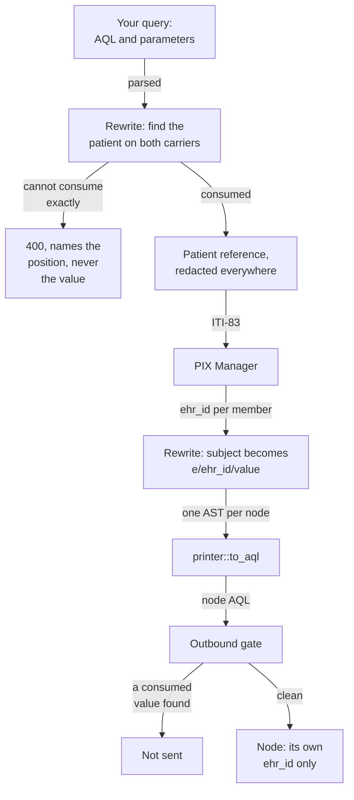
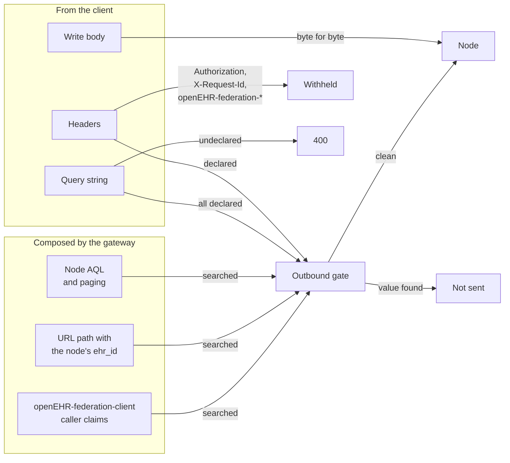

<!-- SPDX-FileCopyrightText: Vernum Projecten B.V. -->
<!-- SPDX-License-Identifier: BUSL-1.1 -->

# Where the patient identifier stops

The patient identifier you put in a query is resolution input. The gateway
consumes it, resolves it to each node's own `ehr_id`, and then locates every
node by that `ehr_id` alone. No part of a request the gateway composes for a
node carries the identifier: not the AQL, not the path, not the query
string, not a header (§5.4.1, N33). This is the central safety property of
the specification, and its adversarial test track (§16, track 10). A
pseudonym is handled exactly like a direct identifier (§5.3).

## The identifier's path through the gateway

The diagram shows §5.4.3 and §7.1 with the conformance points CP-2, CP-26
and CP-38. Two independent layers stop the identifier: the rewrite, which
builds the node query from the parsed AST, and the outbound gate, which
re-reads each finished request before it leaves.

- **Both carriers resolve.** The patient may sit in
  `EHR_STATUS.subject.external_ref`, or in an `ENTRY`-level `subject` with
  its `issuer` or `type`. Both are resolution input on equal terms (§5.4.3,
  CP-38).
- **Strip or refuse, nothing in between.** A value the gateway resolved on is
  removed with its namespace. A second patient value, a subject under `OR`,
  `!=` or `LIKE`, the subject in `ORDER BY`, or the patient value anywhere
  else in the query is a `400` before any dispatch (§5.4.1, §5.4.3).
- **The value is the test.** A clinician or facility identifier on
  `composer` or `health_care_facility` is ordinary query material and is
  sent (CP-2). The same value as the patient's, on any path, is refused
  (CP-26).
- **Text the parser drops never travels.** The node query is printed from the
  rewritten AST, so a comment or a string spliced around it cannot reach a
  node.
- **A selected subject comes back from the gateway.** The node is asked for
  `ehr_id` rows, and the gateway re-injects the value you sent (N5, CP-7).

## What the outbound gate reads

Every request to a node passes the gate, a federated query and a routed
follow-up alike. The gate searches each part a node can read for every
value resolution consumed, in plain and in escaped form. For a routed
request it also decides which of the client's own parts travel at all, from
the parameters the matched ITS-REST operation declares.

- The URL authority and the `Host` header come from your registry, never
  from a request, so the gate does not read them (§5.4.1).
- The `openEHR-federation-client` token the gateway signs for each node
  carries claims about the verified caller. The gate reads each of them
  before it is signed, and a caller claim that would carry the identifier
  refuses the request with nothing sent
  ([What a node is told about the caller](../operate/authentication.md#what-a-node-is-told-about-the-caller)).
- A write body is clinical content. A `DV_IDENTIFIER` inside a committed
  `COMPOSITION` reaches the node byte for byte, because the gateway has no
  right to alter it (§5.4 scope note, N22).
- `GET {base}/v1/ehr?subject_id=…` names the patient in its query string. The
  gateway resolves that subject and sends the node
  `GET {base}/v1/ehr/{ehr_id}` with no query string
  ([Reading an EHR by subject](../integrate/follow-ups.md#reading-an-ehr-by-subject)).
- An ask-all probe carries the path `ehr_id`. It is sent only for an
  `ehr_id` that is a bare UUID, because any other `HIER_OBJECT_ID` form could
  be a patient identifier, and the probe would send it to every member.

## The gateway's own surfaces

The rule covers what a node receives. FerroFED holds its own records to the
same rule, because a log pipeline or a metrics store is read by people the
patient never dealt with. No specification governs these surfaces: our own
design.

| Surface | What it carries instead |
|---|---|
| Error bodies and refusals | the position of the offending path or leaf, never the value |
| The request log | method, route template, status, latency and request id; no body, AQL text, header value or request path |
| Metrics labels | closed enums and registry endpoint ids only |
| A node's error message quoted in `meta.federation` | the message with each consumed value masked |
| The stored-query store | parameterised AQL; a literal patient identifier is refused |
| Integrity incidents | the `ehr_id` and the claiming endpoints, never a patient identifier |

The [identity resolution](../operate/identity.md) page configures the PIX
Manager the identifier goes to.
